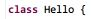
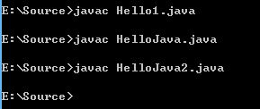

## 1.1 Java源文件

### __代码清单__
包：`com.sco._1st` 
类清单： 

* `com.sco._1st.HelloJava`
* `com.sco._1st.Hello1`

### __基本概念__
Java的源文件必须以.java结尾，每一个源文件中可定义多个class，但public的class只能定义一个，定义过后必须遵循下边两条规则：

1. 若类不带public修饰：源文件的文件名和其中某一个class的名称一致即可； 
   
2. 若类带了public修饰：源文件的文件名必须和定义的public的class的类名一致； 
   

Class的数量：>= 0 
Public Class的数量：<= 1

*\*：Java的源文件和类名同名是Java语言规范，但是实际从语言的设计上讲，这个规范是没有必要的，编译器不应该把类名和文件名关联，例如C++或C语言中的类名，实际上这种关联反而使得Java语言本身拥有了对应的局限性；所以Java语言在这一点上十分特殊，在学习的时候需要记忆，特别小心。*

代码中HelloJava类的源文件名称为`HelloJava.java`，因为包含了一个public的class；而Hello1中有两个class，且都没有public修饰，这种情况下，源文件可以是`Hello1.java`，也可以是`HelloJava1.java`。

### __实验__
目的：测试编译下边三个类 
环境：非Eclipse环境

* 实验1：HelloJava.java，非public类Hello，public类HelloJava
* 实验2：Hello1.java，两个非public类
* 实验3：HelloJava2.java，两个非public类

实验2、实验3的代码内容一模一样。

