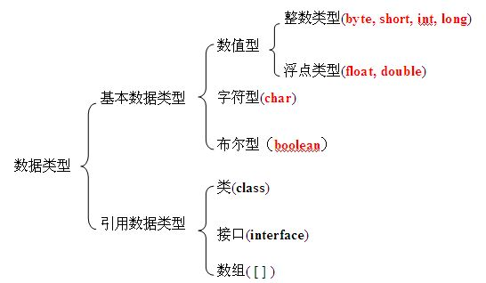
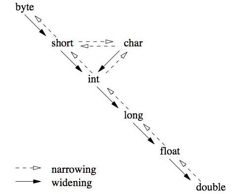

## 1.8 数据类型转换

### __代码清单__
包：`com.sco._1st` 
类清单： 

* `com.sco._1st.NumberLiteral`
* `com.sco._1st.DoubleETester`

### __基本概念__
Java的类型转换主要包含两大类，本章先不讨论类、接口之间的类型转换，主要讨论基本数据类型以及java.lang.String相关的类型转换：

* 自动转换（又称为隐式转换）
* 强制转换（又称为显式转换）

Java语言中的类型树如下： 

而Java语言中根据“自动转换”和“强制转换”可遵循两种典型的转换原则：

* Narrowing Conversion：缩小窄化转换原则
* Widening Conversion：拓展转换原则

针对两种转换原则看看下边的图来理解基本数据类型之间的转换关系： 

*拓展转换在Java中属于自动转换，只要满足：A）两种类型是兼容的；B）目的类型的范围（位数）比来源类型大；这两种条件满足的情况下，拓展类型转换会自动发生。*

#### __1.类型字面量（Literal）__
讨论类型转换之前先谈谈不同数据类型的字面量，什么叫做字面量？字面量（Literal）是用来表达源代码中一个固定值的表示法（Notation），几乎所有的计算机语言都具有对基本值的字面量表示，如：整数、浮点数、字符串，而有很多布尔和字符类型也支持字面量表示，包括一些特殊的语言还支持枚举类型、数组、记录、对象等复合类型的字面量。仔细研究代码`com.sco._1st.NumberLiteral`里面关于字面量的赋值问题，比如有下边的Java表达式 

	byte shortVal = 12;        // Correct
	byte shortVal = 150;       // Incorrect
	int intVal = 12L;          // Incorrect
在表达式中`12`和`12L`都属于“字面量”，字面量一般是一个常量值，它可以直接通过`=`赋值的方式将值赋给定义的变量，而在字面量赋值的过程就会存在类型检查的过程，前边一个章节提过了，Java是强类型语言，所以在任何会出现转型的地方，JVM都会对其进行类型检查。

	int intVal = 12L;         // Incorrect
	intVal = (int)12L;        // Correct

上边第一行为什么错了呢？这句话的字面量使用的值为`12L`，它表示一个long类型的值，而定义的intVal变量是一个int类型，结合上图，`long -> int`属于Narrowing Conversion（缩小转换），在缩小转换这种情况下如果出现了左值和右值的不匹配，编译器就会报错（*：自动转换失效，只能执行强制转换。）。在这种情况下考虑的不是范围问题，而是类型的兼容问题，实际上Java中的整数有两种字面量：

* 如果一个整数字面量没有带上任何后缀，则它的默认类型是int类型（3.自动提升中会阐述原因）；
* 如果一个整数字面量带上了`L`和`l`的后缀，则它的类型就是long类型；

那么问题就来了，如果默认类型是int类型，那么`byte shortVal = 12;`这句话为什么会通过编译呢？字面量和变量不同，JVM在处理的时候估计是使用下边的流程【推测，可根据字节码验证】：

* 处理字面量：JVM先确定字面量的类型，比如12L表示long类型，而12默认应该是一个int类型，但因为12满足上边提到的A条件，int, short, byte, char都属于兼容类型，也就是说，最终针对字面量的赋值根据两点进行判断： 1）检查字面量值的范围，看是否有多个兼容类型，12默认JVM会分配4个字节表示int类型，但有可能最终赋值不是int而是short或者其他； 2）检查左边变量的定义是否符合兼容类型的条件，如果符合则直接执行类型自动转换；
* 处理变量：没什么好说的，处理变量的时候和使用`12L`是一个道理，左右都已经确定了类型，严格按照Narrowing，Widening的转换原则进行。

为了加深理解，看看下边代码行为什么错：

	byte byteVal = 128;        // Incorrect
	short shortValue = 32768;  // Incorrect

上边两行代码都无法通过编译，同样是赋值，为什么12可以通过编译，而上边代码就不行，这就涉及到前边谈到的B条件，byte类型的数据最大值是127，如果使用`128`赋值则会导致JVM认为128已经越界，无论如何都不可能是byte类型，这个字面量已经超过了类型的范围，在超过类型范围过后就不认为128是byte类型，如果使用`byte byteVal = (int)128;`虽然可以通过编译，但byteVal的值会变成-128。

#### __2.变量__
变量的赋值比字面量简单，因为变量不存在类型的推断过程，看看下边的代码。

	shortVal = intVal;        // Incorrect
	shortVal = (short)intVal; // Correct
	intVal = shortVal;		  // Correct

上边的三行代码只有第一行通不过编译，为什么？第一行是从intVal到shortVal的转换，属于Narrowing Conversion，而且JVM已经知道了左值和右值的数据类型，这种已经明确了转换属于Narrowing Conversion的情况，只能使用第二行的方式，进行强制转换来完成；而第三行属于Widening Conversion，int和short是兼容类型，所以“自动转换”就发生了。

#### __3.自动提升__
Java在进行表达式运算的时候，如果运算的几个变量类型不一致，JVM就会采取“自动提升”类型的操作。(*：这个章节解释了上边提到的如果整数字面量没有带上任何后缀就默认是int类型。)

	byte a = 10;
	byte b = 20;
	byte c = a * b;    // Incorrect
	int c = a * b;	   // Correct
上边这个例子特别容易理解，和上边的`byteVal = 128;`一个道理，第三行无法通过编译，因为a * b的最终结果是200，已经越过了127的边界值，所以JVM已经自动将a * b的右值判断为非byte类型了。

	byte i = 50;
	i = i * 2;		   // Incorrect
	i = 50 * 2;        // Correct
	i = (byte)(i * 2); // Correct
上边代码段第三行就不讲了，最终结果里`i * 2`的值只有100，为什么会编译通不过呢？主要原因就在于：如果一个整数字面量没有带上任何后缀，则它的默认类型是int类型！所以上边代码JVM做了下边的思考：

1. 右值不属于常量运算，所以需要推断操作数的类型，若执行的是常量运算（和第三行一样），对运算结果直接处理；
2. 可推断i的类型是byte，值是50；而2是一个整数类型的字面量，默认类型是int，值是2；
3. 执行“自动提升”，遵循自动提升规则，提升为int类型，最终计算结果也属于int类型；
4. 因为程序将一个int类型的值赋值给啊一个byte变量，对不起属于Narrowing Conversion，如果不执行强制转换则这个过程无法完成，编译通不过；

自动提升规则

* 所有的byte、short、char类型的值都会在计算过程提升为int类型；
* 如果有一个操作数是long类型，计算结果是long类型；
* 如果有一个操作数是float类型，计算结果是float类型；
* 如果有一个操作数是double类型，计算结果是double类型；

#### __4.浮点类型__

浮点数字面量规则，其他的这里不阐述。

* 如果字面量不使用任何后缀，则默认类型属于double类型（*：和整型不一样的地方是这个过程不存在类型推断，主要原因是浮点数只有两种不兼容类型double和float）；
* 如果字面量带了`F`或`f`的后缀，则类型属于float类型
* 如果字面量带了`D`或`d`的后缀，则类型属于double类型，因为浮点数的特殊性，所以一边不使用`D`和`d`后缀，因为默认类型已经属于double了；

需要解释的是浮点类型还有一种科学计数法的字面量，看看下边的代码：

		double x = 3.56E10;
		double y = 3.45E-8;
		System.out.println(x);
		System.out.println(y);
上边的代码是可以通过编译的，使用的方式是科学计数法的方式，不仅仅是double类型，float类型在科学计数法的后边加上f或F的后缀也是可以的，如下边的代码：

		float x1 = 3.56E10f;
		float y1 = 3.45E-8f;
		System.out.println(x1);
		System.out.println(y1);

### __实验__

目的：理解基础类型的转型 
环境：Eclipse环境

* 实验1：书写一段代码，在代码中体会转型的概念
* 实验2：书写一段代码理解Java中的“自动提升”，使用浮点类型的字段提升
* 实验3：枚举出可能出现的代码不能自动转型的问题

