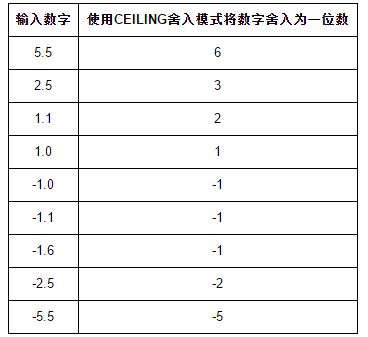
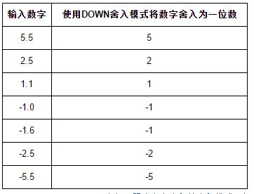
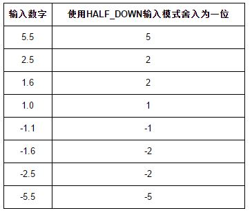
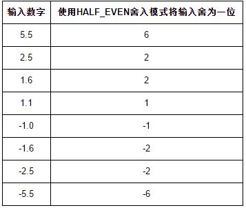
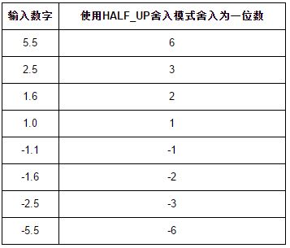
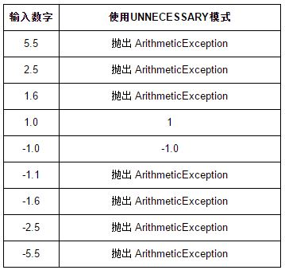
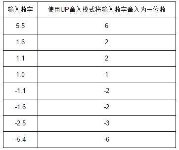

## 1.11 BigInteger & BigDecimal

### __代码清单__
包：`com.sco._1st` 
类清单： 

* `com.sco._1st.TestBigInteger`
* `com.sco._1st.TestBigInteger2`
* `com.sco._1st.TestBigInteger3`
* `com.sco._1st.TestBigInteger4`
* `com.sco._1st.DoubleFormat`

### __基本概念__
如果使用Java进行数值运算的时，如果一个数值过大，超过了long类型的范围，那么这种情况下就需要使用到BigInteger类型，而对于浮点数的精度问题的解决，则使用BigDecimal取代前一个章节中提到的输出格式化。这两个类都在`java.math`包中，其用法目的如下：

* `java.math.BigInteger`：当数值超过long类型的范围时使用这个类进数学运算；
* `java.math.BigDecimal`：当浮点数对精度要求很高的时候，一般使用BigDecimal替代原始的float和double，而且BigDecimal也可以用于值范围越界的情况。

理论上这两个数可以表示无限大的数，只要计算机的内存足够大，看看这两个大数的基本API。

#### __1.API清单__

* __BigInteger abs()__：返回BigInteger的绝对值
* __BigInteger add(BigInteger val)__：返回为（this + val）的BigInteger，做加法
* __BigInteger and(BigInteger val)__：返回为（this & val）的BigInteger，进行位与运算
* __BigInteger andNot(BigInteger val)__：返回为（this & ~val）的BigInteger
* __int bitCount()__：返回此BigInteger的二进制补码表示形式中与符号不同的位的常量
* __int bitLength()__：返回此BigInteger的最小的二进制补码表示形式的位数，不包括符号位
* __BigInteger clearBit(int n)__：返回其值与清除了指定位的此BigInteger等效的BigInteger
* __int compareTo(BigInteger val)__：将此BigInteger与指定的BigInteger进行比较
* __BigInteger divide(BigInteger val)__：返回值为（this/val）的BigInteger，做除法
* __BigInteger[] divideAndRemainder(BigInteger val)__：包含返回（this/val）后跟（this & val）的两个BigInteger的数组
* __double doubleValue()__：将此BigInteger转换为double
* __boolean equals(Object s)__：比较此BigInteger与指定的Object的相等性
* __BigInteger flipBit(int n)__：返回其值与对此BigInteger进行指定位翻转过后的值等效的BigInteger
* __float floatValue()__：将此BigInteger转换为float
* __BigInteger gcd(BigInteger val)__：返回一个BigInteger，值为abs(this)和abs(val)的最大公约数
* __int getLowestSetBit()__：返回此 BigInteger 最右端（最低位）1 比特的索引（即从此字节的右端开始到本字节中最右端 1 比特之间的 0 比特的位数）
* __int hashCode()__：返回此BigInteger的哈希码
* __int intValue()__：将此BigInteger转换为int
* __boolean isProbablePrime(int certaintry)__：如果此 BigInteger 可能为素数，则返回 true，如果它一定为合数，则返回 false
* __long longValue()__：将此BigInteger转换为long
* __BigInteger max(BigInteger val)__：返回this和val的最大值
* __BigInteger min(BigInteger val)__：返回this和val的最小值
* __BigInteger mod(BigInteger val)__：返回this mod val的结果，取模运算
* __BigInteger modInverse(BigInteger val)__：返回其值为 (this-1 mod val) 的 BigInteger
* __BigInteger modPow(BigInteger exponent,BigInteger val)__：返回其值为 (thisexponent mod val) 的 BigInteger
* __BigInteger multiply(BigInteger val)__：返回值为（this*val）的BigInteger
* __BigInteger negate()__：返回值是（-this）的BigInteger
* __BigInteger nextProbablePrime()__：返回大于此BigInteger的可能为素数的第一个整数
* __BigInteger not()__：返回其值为（~this）的BigInteger
* __BigInteger or(BitInteger val)__：返回值为（this|val）的BigInteger
* __BigInteger pow(int exponent)__：返回其值为 (thisexponent) 的 BigInteger
* __static BigInteger probablePrime(int bitLength,Random rnd)__：返回有可能是素数的、具有指定长度的正 BigInteger
* __BigInteger remainder(BigInteger val)__：返回其值为 (this % val) 的 BigInteger
* __BigInteger setBit(int n)__：返回其值与设置了指定位的此 BigInteger 等效的 BigInteger
* __BigInteger shiftLeft(int n)__：返回其值为 (this << n) 的 BigInteger
* __BigInteger shiftRight(int n)__：返回其值为 (this >> n) 的 BigInteger
* __int signum()__：返回此 BigInteger 的正负号函数
* __BigInteger substract(BigInteger val)__：返回其值为 (this - val) 的 BigInteger
* __BigInteger xor(BigInteger val)__：返回其值为 (this ^ val) 的 BigInteger

*：这里的加法减法以及乘除法等所计算的方法会得到一个新的返回值，而对象本身不改变。

	BigInteger a1 = BigInteger.valueOf(1000L);
	BigInteger a2 = a1.add(BigInteger.valueOf(500));
	System.out.println(a1);
	System.out.println(a2);
上边代码的输出为：

	1000
	1500
也就是说`a1.add`的调用会生成一个新的值，而a1本身没有任何改变，这一点在大数运算中需要注意。

#### __2.基本常量__

1. `BigInteger.ONE ( BigDecimal.ONE )` 1
2. `BigInteger.TEN ( BigDecimal.TEN )` 10
3. `BigInteger.ZERO ( BigDecimal.ZERO )` 0

*：因为BigInteger和BigDecimal都属于java.math包，所以在使用的时候需要import这两个类，然后才能使用。

#### __3.BigDecimal浮点数__
前边一节提到了浮点数的精度问题，BigDecimal可以解决精度问题，它提供的一个不变的、任意精度的符号十进制对象，主要有四个构造函数，其中两个是使用BigInteger进行构造，这里重点看看两个特殊的构造函数

* BigDecimal(double val)
* BigDecimal(String val)

这两个构造出来的内容输出有点区别：

	System.out.println(new BigDecimal(123456789.01).toString());
    System.out.println(new BigDecimal("123456789.01").toString());
上边两行代码对应的输出为：

	123456789.01000000536441802978515625
	123456789.01
实际上从输出的内容而言可以知道使用String字面量的构造方式不会出现精度问题，虽然BigDecimal本身就是为了解决精度问题而出现的，但实际应用中还是会存在一定的精度问题，特别是遇上float和double数据的时候，所以在使用BigDecimal的时候尽可能使用字符串字面量构造。

#### __4.BigDecimal舍入模式__
BigDecimal在使用的时候支持四舍五入的计算，它的舍入模式（`java.math.RoundingMode`）主要分为下边几种：

* `RoundingMode.CEILING`：天花板模式，如果大于0则使用`RoundingMode.UP`，如果小于0则使用`RoundingMode.DOWN`； 注意：这种模式不会减少计算值； 

* `RoundingMode.DOWN`：向零方向舍入模式； 注意：这种模式不会增加计算值的绝对值； 

* `RoundingMode.FLOOR`：地板模式，向负无限大方向舍入的模式，如果结果为正则使用`RoundingMode.DOWN`，如果结果为负则`RoundingMode.UP`； 注意：这种模式始终不会增加计算值； 

* `RoundingMode.HALF_DOWN`：向接近数字的方向舍入，如果与两个相邻数字距离相等则向下舍入，如果舍弃部分>0.5，则舍入行为`RoundingMode.UP`，否则为`RoundingMode.DOWN` 

* `RoundingMode.HALF_EVEN`：向最接近数字的方向舍入，如果两个距离相等，则向相邻的偶数舍入，如果舍弃部分左边数为奇数，则舍入行为同`RoundingMode.HALF_UP`，如果为偶数，则舍入行为为`RoundingMode.HALF_DOWN` 
注意：在重复进行一系列运算时，这个舍入模式在统计上将累加错误减小，这种舍入也称为“银行家舍入模式”，主要在美国使用，这种舍入模式就是Java中对float和double的舍入策略。 

* `RoundingMode.HALF_UP`：这个舍入模式就不说了：__“四舍五入”__ 

* `RoundingMode.UNNECESSARY`：用于断言请求的操作具有精确结果的舍入，如果非精确结果会抛出异常 

* `RoundingMode.UP`：向远离0的方向舍入，时钟对非零舍弃部分前面的数字加1，这个模式不会减少绝对值。

### __实验__

目的：理解BigDecimal和BigInteger的用法 
环境：Eclipse环境

* 实验1：书写一段代码，使用BigInteger并理解用法
* 实验2：书写一段代码，使用BigDecimal并理解用法

### __测试用例__
类清单： 
被测试类：

* `com.sco._1st.test.BigIntegerCase`
* `com.sco._1st.test.BigDecimalCase`

测试用例：

* `com.sco._1st.test.BigNumberTestCase`