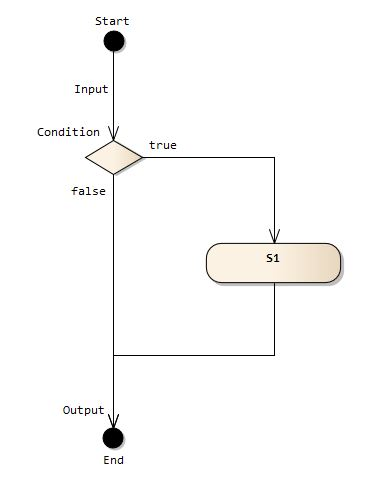
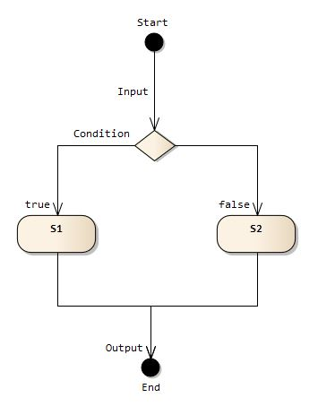
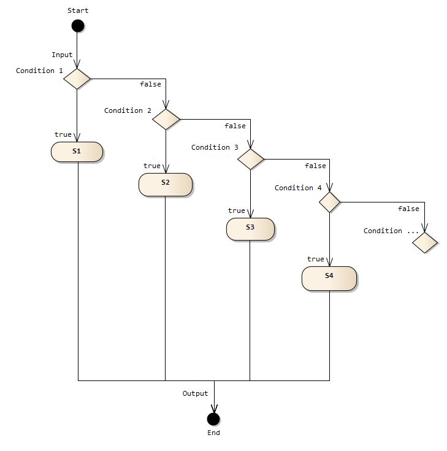

## 1.16 Java中的选择：If, If-Else, Switch

### __代码清单__
包：`com.sco._1st` 
类清单： 

* `com.sco._1st.SelectionIfStatement`
* `com.sco._1st.SelectionIfStatement1`
* `com.sco._1st.SelectionIfElsStatement`
* `com.sco._1st.SelectionMulti`
* `com.sco._1st.SwitchBreak`
* `com.sco._1st.SwitchBreak1`
* `com.sco._1st.SwitchCase`
* `com.sco._1st.SwitchDefault`
* `com.sco._1st.SwitchStr`

### __基本概念__
程序设计常见的语句包括下边几种：

* 顺序语句
* 选择语句
* 循环语句

顺序语句在这里不需要学习，就是按照源代码编写的顺序依次执行，这个章节学习Java语言中的选择语句，Java语言中的选择语句主要有三种：

* if语句
* if-else语句
* switch语句

#### __1.选择的三种类型__

单选择结构（If Statement）： 

双选择结构（If-Else Statement）： 

多选择结构（If-Else, Switch Statement）： 

#### __2.if语句__
Java语言中的if语句和C语言的if语句的语法是相同的，它的基本语法如下：

	if(boolean expression){
		// Statement Code
	}
注意Java语句的if关键字的条件只能是boolean的返回值，不能像C语言一样只要不为空都是true。

	boolean flag = Integer.compare(11,12) < 0;
	if(flag)
		System.out.println("Smaller!");
		
	if(Boolean.valueOf(flag)){ 	// Since JDK 1.5
		System.out.println("Smaller!");
	}
		
	/*if(Integer.compare(11, 12)){	
	 * Incorrect
	}*/
注意上边的if语句中的flag的类型必须是boolean类型，这个条件如果是java.lang.Boolean类型在JDK 1.5之后也是可以通过编译的，JDK 1.4却不行。JDK 1.4的时候不支持自动拆箱功能，像上边的语句`Boolean.valueOf(flag)`的返回值就是java.lang.Boolean类型，因为无法自动转换成boolean类型的表达式，所以写在if语句的括号里是会导致编译错误的。

__*If中的大括号问题*__

还有一点需要说明就是关于大括号的问题：`{}`，if的判断表达式之后如果加了大括号`{}`表示if的子语句，也就是条件满足的时候这个大括号内的所有语句都会执行，如果不加大括号则只有第一句能执行。下边是常见的错误：

	int a = 12;
	int b = 10;
	int ret = 12;
	if( a < 0 )
		ret = ret + 2;
		ret = ret + b;
	System.out.println(ret);
最终输出非预期输入，输出值为`22`，因为没有使用`{}`，所以`ret = ret + b;`这句话会被执行，虽然`a < 0`判断条件为false，不执行的语句只有`ret = ret + 2;`，所以if语句在不加`{}`的时候只会执行接下来的一个分号语句，所以归纳起来if的语法应该包含下边两种：

	// 语法1：
	if(boolean expression)
		Statement 1;

	// 语法2：
	if(boolean expression){
		Statement 1;
		Statement 2;
		......
	}

\*：一般在编程的过程中，及时if条件语句之后只有一条语句执行，最好的编程习惯是加入`{}`，甚至可以把__语法1__定义为“禁止语法”，语法1很容易导致逻辑错误而不是编译错误，而程序的运行时问题往往比编译时问题更加不容易去Debug。
#### __3.if-else语句__

Java语言中的第二种选择语句是：if-else语句，它的语法如下：

	if(boolean expression1){
		// Expression1 = true, Statement Code
	}else if(boolean expression2){
		// Expression2 = true, Statement Code
	}else{
		// Expression1 = false or Expression2 = false, Statement Code
	}
注意if语句和if-else语句的区别，if语句一般在“可选执行流程”中使用，它不包含另外的情况，而单独的if-else语句是“二选一”的语句，如果条件满足则执行if子句，如果条件不满足则执行else语句，超过一个if的语句会演变成“多选一”的语句，这就是Java语言中的“选择”的体现。

__*二选一语句*__

	int a = 12;
	if( a > 12){
		System.out.println("Bigger than target!");
	}else{
		System.out.println("Less than or equal to target!");
	}
上边这句输出为：`Less than or equal to target!`。

__*多选一语句*__

	Random random = new Random();
    int result = random.nextInt(3);
    if( result == 2){
        System.out.print("This is if block,");
        System.out.println("Test block flow.");
    }else if( result == 1){
        System.out.println("This is if single flow.");
        System.out.println("This is Inner or Outer."); 
    }else {
        System.out.print("This is other flow.");
        System.out.println("This is single else flow."); 
    }
    System.out.println("Main flow.");
这个输出会根据随机生成的数`result`去执行不同的打印语句。
	
__*If-Else中的大括号问题*__

If-Else语句和If语句一样也有`{}`的问题，但是对于“多选一”的中间`if else`语句，如果不加大括号编译器会直接报错，所以最容易出错的是第一个if语句和最后一个else语句。如果上边的代码部分去掉了最后一个`else`语句包含的大括号，则下边这句话任何时候都会执行：

		System.out.println("This is single else flow."); 
也就是说输出中一直都会出现下边的语句：

	This is single else flow.
	Main flow.

\*：同样的编程过程中，第一if语句和最后一个else语句即使只有一条语句执行，最好的编程习惯是加入`{}`防止逻辑错误。

#### __4.switch语句__
当条件过多的时候，If-Else的“多选一”语句会变得逻辑不清晰，而且十分冗长导致维护起来比较繁琐，Java语言提供了标准的“多选一”语句——switch。看看下边的代码：

	Random random = new Random();
	int i = random.nextInt(5) + 1;
	if( i == 1 ){
		System.out.println("First!");
	}else if( i == 2){
		System.out.println("Second!");
	}else if( i == 3){
		System.out.println("Third!");
	}else if( i == 4){
		System.out.println("Forth!");
	}else if( i == 5){
		System.out.println("Five!");
	}else{
		System.out.println("Other!");
	}
上边是使用If-Else构造的“多选一”的代码，但这种写法难免会让人头疼抽风，一般情况超过三个分支语句就提倡使用switch语句代替，swtich语句的语法如下：

	switch(input element){
	case element1:{ Statement for element1 };break;
	case element2:{ Statement for element2 };break;
	case element3:{ Statement for element3 };break;
	...
	default:{ Default situation };break;
	}

* element：输入因子，等价于上边代码中的i，也是需要进行匹配的变量；
* element1，element2，element3：匹配因子，等价于上边代码中的1，2，3，4，5；
* break：这个关键字在swtich语句中很重要，等下会用例子详细讲解有break和没有break的区别；
* default：等同于上边代码中的最后一个else语句，当其他所有的匹配都不满足的时候执行default语句；

看看下边这段改写过后的代码：

	switch (i) {
	case 1:
		System.out.println("First");
		break;
	case 2:
		System.out.println("Second");
		break;
	case 3:
		System.out.println("Third");
		break;
	case 4:
		System.out.println("Forth");
		break;
	case 5:
		System.out.println("Fifth");
		break;
	default:
		System.out.println("Other!");
		break;
	}

__*switch中的输入因子*__

switch的输入因子可支持的数据类型是有限的，在使用的时候需要小心，而且针对不同的JDK版本，有很明显的输入因子的差距：

* *JDK 1.4*：在JDK 1.5之前的版本中仅仅支持下边几种类型的变量 
__int__类型变量 
__short__类型变量 
__char__类型变量 
__byte__类型变量
* *JDK 1.5*：JDK 1.5中引入了enum枚举类型，switch语句中可以支持枚举类型了。 
__enum__类型变量
* *JDK 1.7*：加入了java.lang.String类型的支持。 
__java.long.String__类型变量

在JDK 1.7之前因为输入因子不支持String类型，所以下边这段代码在低于1.7版本的JDK中是无法编译通过的。

	String name = "b";
	int value = 0;
	switch (name) {
	case "a":
		value = 1;
		break;
	case "b":
		value = 2;
		break;
	case "c":
		value = 3;
		break;
	case "d":
		value = 4;
		break;
	case "e":
		value = 5;
		break;
	default:
		value = 6;
	}
	System.out.println(value);

__*case中匹配因子*__ 
switch语句中的case匹配因子在使用的时候需要注意：

1. case语句后边必须跟的是一个常量或者常量表达式；
2. 如果使用常量表达式，表达式中的每个变量都必须是final修饰（实际还是只有常量）；
3. case后边的常量和常量表达式不能使用相同的值，不能出现相同的两个case情况；

看看下边这段代码：

	final String z = "z";
	String y = "y";
	int value = 0;
	switch (name) {
	case "a":
	// case "a" + y: Incorrect
		value = 1;
		break;
	case "b" + "x":
		value = 2;
		break;
	case "c" + z:
		value = 3;
		break;
	case "d":
		value = 4;
		break;
	/* case "d":
		value = 6; Incorrect;
		break; */ 
	case "e":
		value = 5;
		break;
	default:
		value = 6;
	}

* 上边这段代码y不能用于case表达式是因为y没有使用final修饰，而z因为使用了final修饰所以是可以直接用于case表达式的；
* `case "d"`如果出现两次也会通不过编译。

__*default的位置*__ 
一般在swtich语句中会把default分支写在最后，实际上default在switch语句中的位置并不重要，比如下边的代码也是合法的：

	switch (name) {
	default:
		value = 6;
		break;
	case "a":
		value = 1;
		break;
	case "b":
		value = 2;
		break;
	case "c":
		value = 3;
		break;
	case "d":
		value = 4;
		break;
	case "e":
		value = 5;
		break;
	}

但是default放在前边并不影响switch语句的执行顺序，JVM在处理switch语句的时候会先查看输入因子是否和case中定义的匹配因子匹配，它会逐一检查输入因子，匹配的时候执行当前case中的语句，如果所有的case都不匹配才执行default。

__*break的有和无*__ 
在switch语句中一般case语句和break语句都是成对出现，如果不加break语句会怎么样呢？

	String name = "b";
	int value = 0;
	switch (name) {
	case "a":
		value = 1;
		break;
	case "b":
		value = 2;
	case "c":
		value = 3;
	default:
		value = 6;
		break;
	case "d":
		value = 4;
		break;
	case "e":
		value = 5;
		break;
	}
注意上边这段代码：

* 期望匹配的是b，所以最开始value会被设置成2；
* 因为`case "b"`中没有break结尾语句，会顺序执行`case "c"`的内容，value设置成3；
* default的存在与否没有任何影响，这个时候因为`case "c"`同样没有break结尾语句，所以default语句执行，value设置成6然后从default语句的break结尾跳出，最终value的值是6；

在下边这种就属于break的另外一种应用：集合匹配，因为case不支持多个值，所以当多个值出现的时候需要使用break语句进行“群分”。

	public static void main(String args[]){
		for( int i = -1; i < 11; i++ ){
			divideEven(i);
		}
	}
	
	public static void divideEven(int input){
		switch(input){
		case 2:
		case 4:
		case 6:
		case 8:System.out.println("偶数:" + input);break;
		case 1:
		case 3:
		case 5:
		case 7:
		case 9:System.out.println("奇数:" + input);break;
		default:System.out.println("范围外:" + input);break;
		}
	}
上边的输出结果如下：

	范围外:-1
	范围外:0
	奇数:1
	偶数:2
	奇数:3
	偶数:4
	奇数:5
	偶数:6
	奇数:7
	偶数:8
	奇数:9
	范围外:10
这种群分的方式就特别合理使用break。

switch语句是唯一不具有`{}`问题的选择语句，因为case中的语句都会执行，所以一般switch语句可以不使用`{}`。

最后总结一些关于选择的经验性问题：

* if，if-else语句尽可能地加入`{}`，保证不会出现任何逻辑错误；
* 如果超过三个分支，尝试把if-else修改成switch语句，否则else-if中的条件会变得特别复杂；
* switch语句中非“群分”的方式，一般case和break最好都能成对出现。
* 执行完case语句如果没有遇到break或return语句，继续往下执行就不需要再满足匹配条件了，直接执行直到下一个break或return；
* default语句放到前边时，如果default没有break语句，执行完default过后，同样需要执行紧跟着default的语句块，直到遇到break或return；

### __实验__

目的：理解If，If-Else，Switch 
环境：Eclipse环境

* 实验1：书写一段代码，理解If语句；
* 实验2：书写一段代码，理解If-Else语句；
* 实验3：书写一段代码，理解Switch语句；
* 实验4：书写一段代码，理解匹配因子为enum的Switch语句；
* 实验5：使用If-Else语句输出100以内所有的素数（可定义子函数）；
* 实验6：输出20以内所有3的倍数（老老实实写）；
* 实验7：输出2000以内所有3的倍数和7的倍数（可定义子函数）；
* 实验8：一堆人n个，如果以3个人站成一排多一个人出来，以7个人站成一排刚好合适，以5个人站成一排差2个人，计算n；( n < 100 )

### __测试用例__
类清单： 
被测试类：

* `com.sco._1st.test.CalculateCase`

测试用例：

* `com.sco._1st.test.CalculateTestCase`
