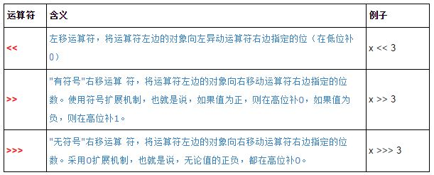

## 1.22 算术运算、位移运算

### __代码清单__
包：`com.sco._1st` 
类清单： 

* `com.sco._1st.OpAddSubstract`
* `com.sco._1st.OpBitMoving`
* `com.sco._1st.OpDivide`
* `com.sco._1st.OpMod`
* `com.sco._1st.OpMultiply`
* `com.sco._1st.OpNumberTester`

### __基础概念__
Java中的算术运算符有五个：`*, /, %, +, -` 
位移运算符有三个：`<<, >>, >>>` 
本章节主要学习Java语言中的这几个运算符，这几个运算符的优先级仅次于一元运算符和强制转换符(type)； 
本章按照优先级顺序讲解这几个运算符。

#### __1.乘法、除法、取模__
本章介绍的运算符中，优先级最高的是下边三个：

* `*`算术乘法运算
* `/`算术除法运算
* `%`取模运算

*乘法*

乘法运算（运算符：`*`）很简单，看看下边的例子：

		int x = 10;
		int y = 11;
		int z = x * y;
		System.out.println(z);
		double x1 = 10.45;
		int y1 = 11;
		double y2 = 12.1;
		double z1 = x1 * y1;
		double z2 = x1 * y2;
		System.out.println(z1);
		System.out.println(z2);
这里不考虑浮点数的精度问题，看看输出：

	110
	114.94999999999999
	126.445
上边代码演示了Java语言中的乘法运算，只有一点需要注意：当`int`和`double`相乘的时候结果类型会自动转换成`double`，但这种情况会出现精度丢失，如果是两个`double`执行乘法运算一般不会出现精度丢失的情况。

*除法*

Java中的除法运算（运算符：`/`）有点点特殊，主要表现在下边两个方面：

* 如果Java语言中除法运算的两个操作数都是整数，则计算结果也会是整数，并且会截断取整，如：`19/4 = 4`；
* 如果除法的两个操作数都是整数类型，则除数不能为`0`，否则引发除零异常；
* 如果除法运算符的两个操作数有一个是浮点数，或者两个都是浮点数，则计算结果也是浮点数；
* 如果除法运算符的两个操作数任中一个是浮点数，此时允许除数为`0`，或者`0.0`，得到的结果是正无穷大或负无穷大；

看看下边的代码体会一下除法的几个特性：

		double a = 5.2;
		double b = 3.1;
		double c = a / b;
		// div的值是一个无限小数
		System.out.println("\t除法结果是：" + c);
		// 输出是正无穷大：Infinity
		System.out.println("\t5除以0.0的值是：" + 5/0.0);
		// 输出是负无穷大：-Infinity
		System.out.println("\t-5除以0.0的值是：" + -5/0.0);
		// 下边的代码将会抛异常
		// java.lang.ArithmeticException: / by zero
		System.out.println("\t-5除以0的值是：" + -5/0);
上边代码的输出结果为：

	除法结果是：1.6774193548387097
	5除以0.0的值是：Infinity
	-5除以0.0的值是：-Infinity
	Exception in thread "main" java.lang.ArithmeticException: / by zero
		at com.sco._1st.OpDevide.main(OpDevide.java:24)
\*：注意Java里面的浮点数除法和C语言中的除法不一样，Java的浮点数运算中的除数是可以为0.0的，而且为0.0的时候最终运算结果是Java语言中定义的正负无穷大，只有当被除数和除数都是`int`类型的数据时，除数为`0`的时候才会报除0的异常。（`java.lang.ArithmeticException`）

*取模*

取模运算符为`%`，又称为求余运算符，JVM中实现`%`是使用先做`/`运算，所以求余运算有下边几个限制条件：

* 当两个操作数都是`int`类型的时候，求余的第二个操作数不能是`0`，否则引发除零异常；
* 取模运算就是在除法运算中取余数的运算，Java中的取模支持浮点数取模；
* 如果两个操作数任何一个都是浮点数，则允许第二个操作数是`0`或者`0.0`，只是求模的结果是非数：`NaN`；

看看下边的代码段理解一下这几个特性：

		double a = 5.2;
		double b = 3.1;
		double c = a % b;
		System.out.println("\tc的值是：" + c);
		System.out.println("\t5对0.0取余的结果是：" + 5 % 0.0);
		System.out.println("\t-5.0对0取余的结果是：" + -5.0 % 0);
		System.out.println("\t0 对5.0求余的结果是：" + 0 % 5.0);
		System.out.println("\t0 对0.0求余的结果是：" + 0 % 0.0);
		// 下边代码将会抛出异常
		System.out.println("\t-5对0求余的结果是：" + -5 % 0);
输出结果为：

	c的值是：2.1
	5对0.0取余的结果是：NaNException in thread "main" 
	-5.0对0取余的结果是：NaN
	0 对5.0求余的结果是：0.0
	0 对0.0求余的结果是：NaN
	java.lang.ArithmeticException: / by zero
		at com.sco._1st.OpMod.main(OpMod.java:22)
\*：注意Java语言中取模运算的除零异常和除法的除零异常的触发条件是一致的，而且Java语言中的取模运算支持浮点数。

#### __2.加法、减法__
Java语言中的加法、减法运算优先级仅次于`*, /, %`三个运算符，和算术运算的加法、减法的用法是一样的，简单看一下代码就可以了：

		// 1.加法、减法常规用法
		double a = 5.2;
		double b = 3.1;
		double c = a + b;
		double d = a - b;
		System.out.println("\tc的值是：" + c);
		System.out.println("\td的值是：" + d);
		// 2.加法特殊用法：字符串连接
		String left = "Hello ";
		String right = "Add operator";
		String result = left + right;
		System.out.println("\tresult的值是：" + result);
代码输出结果为：

	c的值是：8.3
	d的值是：2.1
	result的值是：Hello Add operator
\*：注意操作符`+`有一个特殊用法，就是做字符串连接，可以将两个字符串连接到一起形成一个新的字符串。

#### __3.位移运算符__
Java的位移运算符操作的是对应数据类型的二进制位，也可以单独使用位移运算符来处理int类型的数据，详细内容如下： 
 
先看看下边的简单例子来理解Java里面的三个运算符。

__有符号右移`>>`__

	-5 >> 3 = -1 	// 负数运算：等价于 Math.floor((double)-5 / ( 2 * 2 * 2 ))
		 1111 1111 1111 1111 1111 1111 1111 1011
		 1111 1111 1111 1111 1111 1111 1111 1111(011)
	
	5 >> 3 = 0 		// 正数运算：等价于 5 / ( 2 * 2 * 2 )
		 0000 0000 0000 0000 0000 0000 0000 0101
		 0000 0000 0000 0000 0000 0000 0000 0000(101)
对有符号右移运算符`>>`而言，把第一个操作数的二进制码往右边移动指定的位数，左边空出来的位以原来的符号位填充，如果第一个操作数原来是正数则左边填充`0`，如果第一个操作数原来是负数则左边填充`1`，所以像上边的`-5`右移3位过后左边填充了`111`，而`5`右移3位过后左边填充了`000`。

__左移运算符`<<`__

	-5 << 3 = -40 	// 等价于 -5 * 2 * 2 * 2
		 1111 1111 1111 1111 1111 1111 1111 1011
	(111)1111 1111 1111 1111 1111 1111 1101 1000

	5 << 3 = 40		// 等价于 5 * 2 * 2 * 2
		 0000 0000 0000 0000 0000 0000 0000 0101
	(000)0000 0000 0000 0000 0000 0000 0010 1000
左移运算符`<<`因为不存在符号问题，所以在Java中属于最简单的位移运算符左移过后右边空出来的二进制位全部使用`0`填充，不论正数负数都直接使用`0`填充，所以相对比较简单。

__无符号右移`>>>`__

	-5 >>> 3 = 536870911	
		 1111 1111 1111 1111 1111 1111 1111 1011
		 0001 1111 1111 1111 1111 1111 1111 1111(011)
`>>>`无符号右移运算符比有符号右移`>>`简单很多，无符号右移的移动规则和有符号右移规则是一致的，唯一不同的地方是，无符号右移的左边填充位只有`0`并不根据符号位的值而有所变化，如上边的`-5`移动三位过后，最左边使用`000`填充。

__其他__

一个有趣的现象是：无论正数、负数，它们的左移、有符号右移、无符号右移32位都是其本身，比如下边的代码：

		int a = -5;
		int b = 456;
		System.out.println(a << 32);
		System.out.println(a >> 32);
		System.out.println(a >>> 32);
		System.out.println(b << 32);
		System.out.println(b >> 32);
		System.out.println(b >>> 32);
输出为：

	-5
	-5
	-5
	456
	456
	456
不仅仅如此，另外一个有趣的现象是，把1左移31位然后再右移（`>>`）31位，结果为`-1`，看看下边的流程：

	0000 0000 0000 0000 0000 0000 0000 0001
	1000 0000 0000 0000 0000 0000 0000 0000		// 左移31位
	1111 1111 1111 1111 1111 1111 1111 1111		// 右移31位

为什么会有这种有趣的现象呢？看看位移运算中需要遵循的基本规则：

* 对于低于`int`类型（如`byte、short、char`）的操作数总是先自动类型转换成`int`类型后再进行位移；
* 对于`int`类型的整数位移 `a >> b`，当`b`的值大于32时，系统先对b对32求余（因为int类型只有32位），得到的结果才是真正的位移的位数； 例如，`a >> 33`和`a >> 1`的结果完全一样，而`a >> 32`的值应该和`a`相同；
* 对于`long`类型的整数移位`a >> b`，当`b`的值大于64时，系统先用b对64求余（因为long类型有64位），得到的结果才是真正位移的位数；

这样就解释上边的“有趣现象”了！

\*：当进行位移运算时，只要被移位的二进制码没有发生有效位的数字丢失（对于正数而言，通常指被移出的全部都是0），不难发现左移`n`位就相当于乘以2的`n`次方，右移`n`位则是除以2的`n`次方。不仅如此，进行位移运算不会改变操作数本身，只是得到了一个新的运算结果，而原来的操作数是不会改变的。

### __实验__

目的：理解算术运算符和位移运算符 
环境：Eclipse环境

* 实验1：书写一段代码，理解优先级最高的算术运算符：`*, /, %`
* 实验2：书写一段代码，理解优先级第二的算术运算符：`+，-`
* 实验3：书写一段代码，理解优先级在算术运算符之后的位移运算符：`>>, <<, >>>`
* 试验4：书写一段代码，使用位移高效运算表达式：2n
