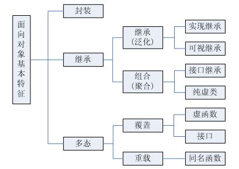
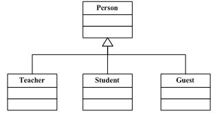
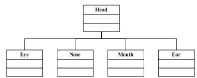
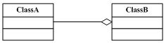
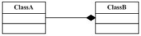
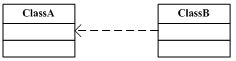
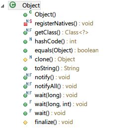

## 2.01 谈谈面向对象

### 代码清单
包：`com.sco._2nd` 
类清单： 

* `com.sco._2nd.oo.ComparedUse`
* `com.sco._2nd.oo.EncapsulationObj`
* `com.sco._2nd.oo.EveryObject`

### 基础概念

OO【面向对象】是一种软件设计的方法论，Java语言中一直有一个比较流行的说法：“Everything is an object.”，从语言上来讲因为Java是一门面向对象的语言，而且从语法特性上来讲，Java里面所有的类`class`的顶级父类是：`java.lang.Object`，先看看对象和类的基本概念。

#### 1.对象和类

类是一种具体事物的抽象，它用来描述具有同一特征事物的一个集合；对象则是某个类所定义的范围内的单个具体事物的表现形式，它主要用来描述某个事物；考虑下边的关系：

	人 -> 这个人

上边的语句很简单，**人**就是一个类，而**这个人**就是一个对象，对象和类所具有的关系是一个：“抽象描述 -> 具象化【实例化】描述”的关系。在创建对象的时候，必须遵循一个原则：“对象只能通过将抽象的东西具象化才能被创建。”——这句话怎么理解，当你描述**这个人**的时候，实际上在你的大脑里，已经先入为主地在描述对象本身了——这个人，只是它在脑海里很清晰地知道：人才是这个人的抽象描述。

怎么去区分抽象和具象化：抽象是没有实体存在的，当你说人这个词语时，在没有划定范围的情况下，它无法用来描述“个体”【实体/实例（instance）】，它所描述的是某一类实例的总和，但是当你加入了定语修饰，哪怕是简单的“这个”，那么“这个人”就可以用来描述“个体”了，语言文字很自由，若你真要去问一个问题：“哪个人？”，那么你永远不可能把OO学好，在OO概念的理解的时候一定要知道：“在一个范围内【上下文环境（Context）】去描述类和对象！”。

* **类**——类是具备某些共同特征的实体的集合，它是一种抽象概念，延伸到程序设计语言上，类就是一种抽象的数据类型，它是对所具有相同特征的实体的一种抽象的描述；
* **对象**——对象是单个特征实体，不描述集合，它是一种具象化的概念，在程序语言中，对象就是一个变量引用或变量本身，它只会存在于某一个特定的上下文环境中，或者以全局的方式存在于整个应用。

##### 1.1 描述规则

在描述对象和类的时候，提供一些基本的思维规则：

* **相对抽象**：在描述人 -> 这个人的时候，它们有一个共同的描述对象就是人，也就是说：“对象这个人是相对于类人的一个具象化描述，而不是相对于类车的一个对象化描述。”，这就是对象和类的基本相对关系，类和对象在描述内容时具有一定的相关相对性，——也可以理解为参照标准一致。
* **抽象的层次**：抽象和具象化本身存在一个粒度概念，比如下边的描述语言： 
`人 -> 男人 -> 男医生 -> 男外科医生 -> 这个男外科医生` 
上边是一个链式结构，在不知道任何需求的时候无法臆断：男人、男医生、男外科医生究竟是类还是对象？很多人会本能觉得这三个都属于类，用来描述的具备某些共同特征的实体的集合。但是如果需求的上下文环境发生变化，比如侧重关注点是：`医生`这个职业，那么在这种情况下：`男外科医生`和`这个男外科医生`实则都属于无意义的具象化，同时`男医生`本身就可以作为一个对象来对待，那么最终结构可能是： `人 -> 男人 -> 男医生`。——也就是说，OO的设计是在于根据需求信息去设计一个合理和符合业务场景的类、对象的结构，而不是随意而为之，粒度本身是跟着需求走的。
* **生命周期**：任何一个具象化的实体是具有“生命周期”的概念的，一个对象从诞生到销毁在系统里都是资源分配的核心点，而类本身更多的理解维度并不是诞生到销毁，而是“已定义”和“未定义”的概念。回到`人 -> 这个人`的例子：

	* **人**本身就是一个类，它是这个世界与生俱来就用语言文字和符号定义好的Class，如果在人类历史发展中，我们使用的符号不是“人”，而是“X”，那么可能在最初定义的我们所隶属的这个物种的定义名就是“X”而不是“人”，也就是说**人**这个类的描述更多使用的是“已定义”和“未定义”的概念，而不是诞生 -> 死亡。
	* **这个人**是**人**的一个实例，它的生命周期就是诞生 -> 死亡的这样一个流程，那么用来描述对象更多时候使用的是“已存在”和“未存在”的概念，在它“已存在”的范围就属于这个对象的整体生命周期。
	* 很多人会觉得**人**这个类也可以用“已存在”和“未存在”来描述，但你仔细想想，只要这个世界没有消失，上帝不改变“人”的定义语义，那么“人”这个类的永恒状态就是“已定义”，至少在“这个世界”【上下文环境】中是永恒的“已定义”的状态。

* **群和个体**：实际上最容易去描述这个世界的整体数据抽象结构的是：群体和个体，对于任何一种事物【某个类Class】而言，它的相关对象要么就是一个对象【Object】，要么就是一群对象【Collection】，纵观现在存在的所有面向对象语言都会有“集合”这个概念，而一般对于集合，不论其类型是数组、列表、链表、哈希表还是树，都可以归纳为一个群体，所以一般的面向对象语言都会把“集合”作为一个章节来考虑，也可以简单用等式来描述： 
`N * 个体 + 数据结构 = 集合（ N > 0 ）`

上边的描述规则主要是用于读者去理解OO的思维，当然OO本身的设计是很自由的，甚至自由到没有任何的约束存在，但是：世界是可以形式化的，这个世界所有的描述基础都是源于分类，分类 -> 子类 -> ... -> 个体，这样一个自顶向下的描述结构。

##### 1.2 对象的三要素

对象的三个要素和OO的三个特征是有区别的，先看看对象的三要素的基本解释：

* 属性：对象自身所拥有的和对象密不可分的隶属于对象的特征描述元素，它表示对象所具有的性质，不同的对象具有不同的属性；
* 操作：由对象主动发起的具有一定控制权的动作，是对象本身所具有的、反映该对象功能的内部函数和过程，即对象本身的动作；
* 事件：对象接受的来自外界产生的非对象可控制的行为，它表示被对象识别的用户动作或对象状态变化发生的信息，即对象的响应；

上边三个东西主要是用来描述对象的，但是它们的定义是在这个对象所相对的类中定义好的，那么是否同一类就可以通过对应的属性和操作来进行匹配，为什么没有事件？？

先举个例子，还是“人”这个类：

* 人拥有眼睛、耳朵、鼻子：这里的眼睛、耳朵、鼻子是隶属于这个人的属性，所以在定义一个Class的时候会使用`Property/Attribute/Field`【尽管这三个词语会有语义的差别】来定义它；
* 人可以吃饭、打电话、听音乐：这里的吃饭、打电话、听音乐是由这个人发起的动作，这种动作当前这个对象具有主动性，所以在定义一个Class的时候会使用`Function/Method`来定义它；
* 人可以接电话、被邀吃饭：这里的接电话和被邀吃饭对这个人而言是被动的，当这个事情发生过后，它只能选择被动的响应，而不能对事件有任何控制权，所以定义一个Class的时候不能去定义`Event`，因为它的不可预知性；

举个简单的例子：

	小明用手拿起电话打电话给小刚，邀请小刚吃饭。

上边这句话是一种场景描述，注意这里是两个对象【如果算电话，则是三个，这里只考虑同一类对象。】：小明、小刚，而不是一个对象，考虑对象的三要素的时候，需要有一个基本考虑点，而不是一锅端，那么拆成两个对象来考虑：

* `小明`： 属性：手 操作：打电话、邀请吃饭
* `小刚`： 属性：手 事件：接电话、被邀请吃饭

看了上边的整理过后是否能够理解了呢？实际上这个场景描述了系统中最常见的对象和对象之间的通讯，当一个对象调用了自己的方法发送消息给另外一个对象的时候，势必对另外一个对象产生一个`Event`事件，那么对小刚和小明两个对象而言，这个场景的操作和事件有什么区别呢？

_**操作**_：操作是由对象发起的行为，也就是说对象本身对操作是有决定权的，如果否定那么这个场景就不会发生，例如上边的例子：如果小明不想给小刚打电话，那么这个场景就不会发生了；

_**事件**_：事件是由对象被动接受的行为，也就是说对象本身对时间只能响应和不响应，没有决定权，自然没有办法去否定这种行为，例如上边的例子：小刚这个对象是不能决定小明是否会打电话的，只能处于被动的立场，在小明打电话的时候选择接听或者不接听。

看了上边的例子过后，是不是对OO设计的对象三要素有了一定的理解了呢？

##### 1.3 OO的三个特征

面向对象的三个基本特征是：封装【Encapsulation】、继承【Inheritance】、多态【Polymorphism】

**封装【Encapsulation】**

封装是面向对象中最容易理解的一个概念，它是面向对象的特征之一，是对象和类的概念的主要特征。字面上理解：封装就是把客观事物封装成抽象的类，并且类可以把自己的数据和方法只让可信的类或者对象操作，对不可信的对象等进行信息隐藏。

看看下边的代码段来理解封装：

	package com.sco._2nd.oo;
	
	class EncapsulationObj1 {
		public String name = "Obj1";
	}
	
	class EncapsulationObj2 {
		private String name = "Obj2";
	
		public String getName() {
			return this.name;
		}
	}
	
	public class EncapsulationObj {
		public static void main(String args[]) {
			EncapsulationObj1 obj1 = new EncapsulationObj1();
			EncapsulationObj2 obj2 = new EncapsulationObj2();
			System.out.println(obj1.name);
			obj1.name = "Broken";
			System.out.println(obj1.name);
			System.out.println(obj2.getName());
		}
	}

* 上边代码定义了两个类：`EncapsulationObj1`和`EncapsulationObj2`，这两个类都有`name`这个属性，唯一不同的是前者的`name`是`public`修饰的。
* 实际上从代码的运行逻辑可以知道，`EncapsulationObj1`中的`name`既可读又可写，而`EncapsulationObj2`中的`name`属性因为使用了`private`修饰所以变成了一个只读属性。
* 计算机的基本操作就是读和写，而封装过后针对对象的属性执行了读写分离，就出现了对象属性的四种基本情况： 
1）既可读又可写； 
2）只可读不可写； 
3）只可写不可读； 
4）既不可读又不可写【对象内部调用】；

实际上上边的`name`在`EncapsulationObj1`中没有使用封装，因为不存在“信息隐藏”，它的`name`属性可以在外部调用的任何时候执行读写操作，这是不推荐的做法；而`EncapsulationObj2`中的`name`就实现了基本的信息隐藏，它的`name`是不可写的，在外部调用只能使用`getName()`的方式执行读操作，这就是OO中的封装的其中一例。

**继承【Inheritance】**

面向对象【OO】中的一个主要功能就是“继承”，继承表示这样的一种能力：它可以使用现有的类的所有功能，并在无需重新编写原来的类的情况下对这些功能进行扩展。

* 通过继承创建的新类称为**“子类”**或**“派生类”**；
* 被继承的类称为**“基类”**、**“父类”**或**“超类”**；
* 继承的过程，就是一个从一般抽象到特殊抽象的过程；
* 要实现继承有两种方式：直接**“继承”**【Inheritance】或**“组合”**【Composition】来实现；
* 在某些OO语言中，一个子类可以继承多个基类（比如C++支持多继承），但是一般情况下，一个子类只能有一个基类，要实现多重继承可以通过多重继承来实现。

继承概念的实现方式有三种：**实现继承、接口继承、可视继承**

* 实现继承：这种继承表示使用属性和方法而无需额外编码的能力；
* 接口继承：接口继承表示仅仅使用属性和方法的名称、但是子类必须提供实现的能力；
* 可视继承：是表示子窗口【子类】使用基窗口【父类】的外观和实现代码的能力；

在考虑使用继承时，有一点需要理解，就是两个类之间的关系是“Is-a”的“属于”关系，比如Teacher是一类人，Student是一类人，这两个类都可以继承Person类；但是Hand类却不能继承Person类，因为手并不是一类人。

OO开发的范式一般为：`划分对象 -> 抽象类 -> 将类组织成为层次化结构【继承和组合】 -> 用类与实力进行设计和实现几个阶段。`

**多态【Polymorphisn】**

多态性【Polymorphisn】是建立在继承基础之上的，允许你讲父对象设置成为和一个或更多其他的子对象相等的技术，赋值过后，父对象就可以根据当前赋值给它的子对象的不同方式运作，简单说：允许子类类型的指针赋值给父类类型的指针。

实现多态的方式有两种：**“覆盖”**、**“重载”**

* 覆盖：是指子类重新定义父类的虚函数的做法，Java中父类没有虚函数的概念，但和它等价的函数为“抽象方法”【Abstract】，实际上：虚函数可以理解成没有任何实现的函数，它等待着子类提供实现——但是有一点需要说明，在覆盖过程中可覆盖的函数不一定是虚函数，有可能是父类提供了实现的实际函数，而子类只是针对该函数进行重写/覆盖以替换默认实现。
* 重载：是表示允许存在多个同名函数，而这些函数的参数表不同【参数个数、或许参数类型、或许两者】；

其实，重载的概念并不属于“面向对象编程”，重载的实现是：编译器根据函数不同的参数表，对同名函数的名称做修饰，然后这些同名函数就成了不同的函数（至少对于编译器来说是这样的）。如，有两个同名函数：

* function func(p:integer):integer;
* function func(p:string):integer;

那么编译器做过修饰后的函数名称可能是这样的：`int_func、str_func`。对于这两个函数的调用，在编译器间就已经确定了，是静态的（记住：是静态）。也就是说，它们的地址在编译期就绑定了（早绑定）——因此，重载和多态无关！真正和多态相关的是“覆盖”。当子类重新定义了父类的虚函数后，父类指针根据赋给它的不同的子类指针，动态（记住：是动态！）的调用属于子类的该函数，这样的函数调用在编译期间是无法确定的（调用的子类的虚函数的地址无法给出）。因此，这样的函数地址是在运行期绑定的（晚邦定）。

结论就是：重载只是一种语言特性，与多态无关，与面向对象也无关！引用一句Bruce Eckel的话：“不要犯傻，如果它不是晚邦定，它就不是多态。”

那么，多态的作用是什么呢？我们知道，封装可以隐藏实现细节，使得代码模块化；继承可以扩展已存在的代码模块（类）；它们的目的都是为了——代码重用。而多态则是为了实现另一个目的——接口重用！多态的作用，就是为了类在继承和派生的时候，保证使用“家谱”中任一类的实例的某一属性时的正确调用。

##### 1.4 概念解析

**泛化【Generalization】**

在上边的图中，空心三角形表示继承关系（类继承），在UML的设计术语中，这种关系被称为泛化（Generalization）--> Person【人】是基类、Teacher【教师】、Student【学生】、Guest【来宾】是子类。

如果在逻辑上`B`是`A`的“一种”，并且`A`的所有功能和属性对`B`而言都有意义，则允许`B`继承`A`的功能和属性；例如、教师是人、Teacher是Person的“一种”，那么类Teacher可以从类Person派生【继承】。如果`A`是基类，则`B`是`A`的派生类，那么`B`将继承`A`的数据和功能；如果类`A`和类`B`毫不相关，不可以为了使`B`的功能更多些而让`B`继承`A`的功能和属性。

在逻辑上这就是常说的典型的 “ Is-A ” 的关系。

**聚合【组合】**

若在逻辑上`A`是`B`的“一部分”，则不允许`B`从`A`派生【继承】，而是要用`A`和其他东西组合出`B`，例如上边的例子：

眼【Eye】、鼻【Nose】、口【Month】、耳【Ear】是头【Head】的一部分，所以Head应该由类Eye、Nose、Mouth、Ear组合而成，不是派生【继承】而成。

聚合的类型分为：**无、共享（聚合）、复合（组合）**三类。

**聚合【Aggregation】**

上边图中，有一个菱形（空心）表示聚合【Aggregation】（聚合类型为共享），聚合的意义表示 “ Has-A ” 的关系，聚合是一种相对松散的关系，聚合类`B`不需要对被聚合的类`A`负责。

**组合【Composition】**

上边这幅图和上边的图唯一的区别是菱形是实心的，它代表了一种更为坚固的关系——组合【Composition】（聚合类型为复合），组合表示的关系也是 “ Has-A ” 的关系，但是有一点区别是`A`的生命周期受到`B`的控制，即`A`会随着`B`的创建而创建，随着`B`的消亡而消亡。

这里的`B`和`A`的关系是一种依赖【Dependency】关系，这种关系表明，如果类`A`被修改，那么类`B`会受到影响了。

*：到这里OO的基本概念就讲解得差不多了，接下来看看Java语言中的`java.lang.Object`,

#### 2.`java.lang.Object`

`java.lang.Object`中主要提供了下边的几种方法，接下来逐一讲解：

* 对象的克隆、拷贝【clone()】
* 类析构方法【finalize()】
* 初始化方法【Object()、registerNatives()】
* 基础类信息方法【getClass()、toString()】
* 对象的比较【hashCode()、equals(Object)】
* 线程状态控制方法【notify()、notifyAll()、wait(long)、wait(long,int)、wait()】

这里不介绍初始化方法、基础类信息方法，因为这两类方法相对而言十分简单，而且在OO设计过程中使用起来也相对简单，这里着重介绍下边几类：

* 对象的克隆、拷贝
* 类析构方法
* 线程状态控制方法
* 对象的比较

##### 2.1.一切事物都是对象

Java中定义的所有类都是从`java.lang.Object`类中继承而来，即使在不使用`extends`关键字的情况下，默认父类就是`java.lang.Object`，看看下边的验证代码：

	package com.sco._2nd.oo;
	
	public class EveryObject {
		// ~ Static Methods ======================================
		public static void main(String args[]) {
			EveryObject obj = new EveryObject();
			System.out.println("Current Class : " + obj.getClass().getName());
		}
	
		// ~ Constructors ========================================
		public EveryObject() {
			Class<?> parent = getClass().getSuperclass();
			System.out.println("Default Class :" + parent.getName());
			System.out.println("What's the top Level ? : " + parent.getSuperclass());
		}
	}

上边代码的输出如下：

	Default Class :java.lang.Object
	What's the top Level ? : null
	Current Class : com.sco._2nd.oo.EveryObject

所以可以得到下边的几个基本结论：

* 所有的Java类，在不使用`extends`从特殊类继承而来时，它的默认父类就是：`java.lang.Object`，这也是Java语言里所称的：“一切事物都是对象”的原因；
* `java.lang.Object`类的父类再往上获取到的内容就是一个“空指针”——虽然Java中一直说不支持“指针”，后边会有专程的章节来说明什么叫做：“Java不支持指针”。

##### 2.2.对象的克隆、拷贝`clone()`

`java.lang.Object`中的`clone()`方法的源码定义如下

	protected native Object clone() throws CloneNotSupportedException;

关于对象的深拷贝和浅拷贝后边有专程的章节说明，这里简单介绍一下`clone()`方法：

1. `native`：这个方法的修饰符中有一个`native`的关键字，一般来说`native`的方法效率远高于Java中的非`native`方法——也就是说推荐使用Object的`clone()`方法二不是使用一个`new`来创建一个对象，然后把原始对象中的信息复制到新对象中。 **JNI——Java Native Interface**的缩写，在Java语法里除了`abstract`抽象方法可以在定义的时候没有方法体，就只有`native`的方法是不需要写方法体的，这种技术主要是为了让Java定义接口，而使用其他的语言来提供执行本地的编译运行，尤其是`C/C++`，只要规范符合那么Java就只提供接口，而不提供实现，实现部分由其他语言来完成，在与旧的库、硬件、操作系统交互时，这种方式可以在很大程度上提高程序的性能。
2. `proctected`：后边会提到Java中的访问控制符，使用了`protected`来修饰方法，意味着只有子类继承的时候才可以重写`clone()`方法，不可以直接调用`java.lang.Object`类的`clone()`方法；
3. `Object`返回值：在使用`clone()`的时候，如果使用了重写，必须用强制类型转换才能得到我们所需要的对象，因为父类的返回值本身是一个`java.lang.Object`；

*：初次接触面向对象，看了这些东西过后是不是有一种云里雾里的感觉，这里只是为了浅析OO而做的一个引导工作，所以不进行对象克隆的深度剖析，仅仅基于`java.lang.Object`的源码进行基础介绍。

##### 2.3.类析构方法`finalize()`

`java.lang.Object`中另外的一个`protected`的方法是`finalize()`：

	protected void finalize() throws Throwable { }

Java和C++不一样，Java提供了一种垃圾收集器的机制，当它运行时【通常在系统内存低到一定限度时自动运行】，会回收不再使用的对象所占用的内存，所以，在Java程序中，我们通常只考虑对象的创建，而不去关心对象的清除。`finalize()`是Java为类提供的一种特殊方法，垃圾收集器的工作大致是这样的：一旦垃圾收集器准备好释放无用对象占用的存储空间，它首先调用那些对象的`finalize()`方法，然后才真正回收对象的内存，通过使用`finalize()`就可以在垃圾收集器运行期间进行一些特殊的工作。

也就是说，当`gc`事件启动时候，它是调用了对象的`finalize()`，来实现真正的回收，那么首先这些对象是没有用的，最简单的使用可以在`finalize()`中添加最简单的`System.out.print`来跟踪系统回收了那些对象，可以深层次地了解系统对象的使用情况，比如哪些对象回收最频繁等等。

**析构？**

C++的程序设计中有构造函数和析构函数，并且是内存管理技术中相当重要的一部分，而在Java语言中只有构造器【构造函数】的概念，却没有析构器或析构函数的概念，但很多人会把`finalize()`当做是Java中的析构函数，实际上这种理解是有误差的。理论上JVM会自己负责对象的析构【销毁和回收】工作，也就是上边提到的垃圾回收的概念。

Java语言真的没有析构函数么？

其实Java语言中的`finalize`方法与C++语言中的析构函数的职能是极为类似，`finalize()`方法是Java语言基类`java.lang.Object`中包含的一个方法，这个方法是`protected`受保护类型，因为Java中所有的`Class`都是`java.lang.Object`的子类，因此用户类都从`Object`类中隐式地继承了这个方法。因此，我们在Java类中可以调用父类的`finalize()`方法。

*：虽然我们可以在一个Java父类的`finalize()`方法，但是这个方法没有实现递归调用，我们必须手动实现，因此`finalize`函数的最后一个语句通常就是`super.finalize()`语句；通过这种方式，可以自己去实现递归调用，即先释放用户类自身的资源，然后再释放父类的资源——通常可以在`finalize`中释放一些不容易控制的资源，并且很重要的资源，如：数据库连接、I/O操作。众所周知：Java中的构造函数模式是实现了递归调用的，它会从子类往父类执行递归调用，先调用父类的构造函数、其次调用它的子类的构造函数最终到定义类，这个是Java中的构造函数和`finalize()`的不同。

`finalize()`方法最终是由JVM中的垃圾回收器调用的，由于垃圾回收器调用`finalize`的时间是不确定、不及时的【后边垃圾回收器原理会介绍】，实际上这个方法的调用时间是不可控的，因此更多的时候还是需要使用其他手段来释放程序中占用的资源，比如自己在类中声名一个`destroy()`方法，在这个方法中添加释放系统资源的处理代码，当你使用完对象过后可以通过调用这个方法来释放对象内部成员占用的系统资源。虽然我们可以这样做，但是一般还是推荐将`destroy()`方法放在当前这个类的`finalize()`方法体中，因为这样做更加保险，更加安全，如果出现了深度继承关系，这种方法就显得更有效，而且可以通过递归调用`destroy()`的方法在子类被销毁的时候释放父类所占用的资源。

*：关于`finalize()`方法的详细内容在垃圾回收器的章节会再通过例子来分析说明，这里就不详细介绍了，这个章节主要的目的是看一看Java中的特殊类`java.lang.Object`究竟提供了什么，因为它是所有的`Class`类的终极老爹！

##### 2.4.线程状态方法

接下来看看`java.lang.Object`中提供的线程状态控制方法。

`notify()、notifyAll()、wait【三个重载】`方法是定义在`java.lang.Object`内的方法用来控制线程的状态，这三个方法最终调用的都是`JVM`中的本地方法【native】，随着`JVM`的不一样这三个方法会有一定的差异。

* 如果对象调用了`wait`方法就会使持有该对象的线程把对象的控制权交出去，然后处于等待状态；
* 如果对象调用了`notify`方法就会通知某个正在等待这个对象的控制权的线程可以继续运行；
* 如果对象调用了`notifyAll`方法就会通知所有等待这个对象控制权的线程继续运行；

`wait`方法的三个重载方法这里不做详细说明，有一点需要注意的是：

1. 任何一个时刻，对象的控制权【Monitor】只能被一个线程拥有；
2. 无论是执行对象的`wait、notify、notifyAll`方法，必须保证当前运行的线程取得了该对象的控制权【Monitor】；
3. 如果在没有控制权的线程里执行对象的以上三种方法，就会报`java.lang.IllegalMonitorStateException`异常；
4. `JVM`基于多线程，默认情况下不能保证运行线程的时序性；

基于上边的几点事实，我们需要确保让线程拥有对象的控制权。

也就是说在`waitThread`中执行`wait`方法时，要保证`waitThread`对`flag`有控制权；在`notifyThread`中执行`notify`方法时，要保证`notifyThread`对`flag`有控制权。

*：关于这几个方法的详细介绍，后边在多线程介绍中会使用例子来介绍这几个线程状态控制方法。

##### 2.5.对象的比较

`hashCode`和`equals`方法在Java语言中属于重写率特别高的两个方法，对象的比较在后边也有专程的章节进行讲解，这里主要看看`java.lang.Object`中的这两个方法的默认实现。

	public native int hashCode();

    public boolean equals(Object obj) {
        return (this == obj);
    }

* `hashCode`方法在`java.lang.Object`方法是被定义为的一个本地方法【native】，它的实现是JVM中的C语言实现；
* `equals`方法在这里需要强调，不论目前还有没有讲解和对象比较相关的内容。 
默认情况下，`equals`方法的比较和`==`含义是一样的，这里的源代码可以明显看得出来，也就是说`equals`在不重写的情况下，其实比较的是两个引用是否指向了同一个对象，而不是比较的对象内容，这个时候：`equals`和`==`是等价的。Java的教程中经常会说： 
1）`equals`方法比较的是两个对象的内容是否相等，即使都是使用的`new`的方式创建的这两个对象，但如果内容一样，则返回值也为`true`； 
2）`==`方法比较的是两个引用是不是指向同一个对象，如果这种情况使用`new`的方式创建，则返回值就一定为`false`； 
实际上从`java.lang.Object`中的`equals`的实现看来，在不重写的情况下，`equals`和`==`是等价的，而不存在上边的两个结论，而Java中最具有代表性地对比上边两个结论的类就是`java.lang.String`这个类。

为了让读者对`equals`和`==`有一定的认识，提供一段示例代码：

	package com.sco._2nd.oo;
	
	class User{
		private String name;
		private String email;
		/**
		 * @return the name
		 */
		public String getName() {
			return name;
		}
		/**
		 * @param name the name to set
		 */
		public void setName(String name) {
			this.name = name;
		}
		/**
		 * @return the email
		 */
		public String getEmail() {
			return email;
		}
		/**
		 * @param email the email to set
		 */
		public void setEmail(String email) {
			this.email = email;
		}
	}
	
	public class ComparedUse {
		public static void main(String args[]){
			// JVM equals
			String str1 = new String("Str");
			String str2 = new String("Str");
			System.out.println("JVM equals : " + str1.equals(str2));
			System.out.println("JVM == : " + (str1 == str2));
			System.out.println();

			// JVM ==
			String str3 = new String("Str");
			String str4 = str3;
			System.out.println("JVM equals : " + (str3.equals(str4)));
			System.out.println("JVM == :" + (str3 == str4));
			System.out.println();
			
			// Defined equals
			User user1 = new User();
			User user2 = new User();
			System.out.println("Defined equals : " + user1.equals(user2));
			System.out.println("Defined == : " + (user1 == user2));
			System.out.println();

			// Defined ==
			User user3 = new User();
			User user4 = user3;
			System.out.println("Defined equals : " + user3.equals(user4));
			System.out.println("Defined == : " + (user3 == user4));
			System.out.println();
		}
	}

上边的代码输出如下：

	JVM equals : true
	JVM == : false

	JVM equals : true
	JVM == :true

	Defined equals : false
	Defined == : false

	Defined equals : true
	Defined == : true

上边的输出已经可以证明了，主要看第一块和第三块的输出差异，看输出的第五行，`equals`方法返回值是`false`，这就是不重写的情况下，对比的结果和`==`都一样，因为是直接从`java.lang.Object`中继承过来的方法。

#### 3.面向对象小结：

到这里相信读者对现象对象的概念有了一定的认识，不仅仅如此，可能Java比较手生的对第二章节`java.lang.Object`有些不理解，但这里仅仅是做一次初次介绍，后边的章节会一一介绍这几大块的内容，包括对象的拷贝、对象的克隆、线程状态的内容，本章节的目的就是介绍“面向对象”程序设计基础。

### __实验__

目的：理解OO 
环境：Eclipse环境

* 实验1：书写一段代码，尝试使用`clone`实现对象拷贝；
* 实验2：书写一段代码，尝试使用`finalize`类析构方法；
* 实验3：书写一段代码，理解对象的比较：`equals`、`hashCode`；
