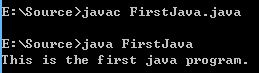
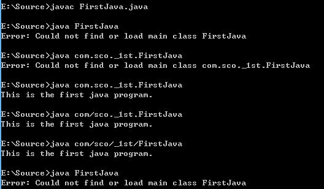

## 1.2 第一个Java程序

### __代码清单__
包：`com.sco._1st` 
类清单： 

* `com.sco._1st.FirstJava`
* `FirstJava` (default package)

### __基本概念__
Java源程序一般是以.java的后缀结尾的，一般配置了Java环境过后就可以直接在Windows命令提示行或者Linux的终端使用&nbsp;javac&nbsp;和&nbsp;java&nbsp;两个命令了：

* &nbsp;javac&nbsp;命令可以将.java的Java源代码编译成.class的二进制字节码；
* &nbsp;java&nbsp;命令则可以直接执行.class的二进制字节码；

Java程序的书写步骤：

1. 书写.java的源代码
2. 使用&nbsp;javac&nbsp;编译Java源代码，并且生成对应的.class二进制字节码
3. 使用&nbsp;java&nbsp;运行Java字节码文件

### __拓展__
Java中常见的运行程序除了.class字节码以外，还包含.jar文件。JAR文件是和平台无关的文件格式，它可以使用压缩软件打开，其格式是基于ZIP压缩文件的格式，JAR文件不仅仅用于压缩和发布，而且可用于部署、封装库、组件、插件程序，并且可以被编译器和JVM直接使用，JAR文件中还可以包含特殊的文件类似：manifests和部署描述符，用来描述什么工具可处理当前JAR文件。
JAR文件的变种：

* JAR文件 .jar：包含了程序入口的JAR文件，这种JAR文件可直接当做Application执行
* JAR库文件 .jar：一般不包含程序入口，但里面包含了其他程序需要使用的类库，当这种JAR文件放在CLASSPATH中就可以直接使用运行程序调用JAR文件中包含的Java类
* WAR文件 .war：如果使用Java开发了Web应用程序，该应用程序可以整体打包成一个.war文件，.war文件的格式和.jar的文件格式类似，只是这种文件主要用于Web应用程序发布
* EAR文件 .ear：如果开发的程序不是Java Web应用程序，而是JavaEE的企业应用程序，比如EJB这种，则.ear文件就用于这种程序的发布

### __实验__
目的：书写第一个Java程序并且使用对应的命令运行 
环境：非Eclipse环境

* 实验1：书写一个不带package定义的Java程序，编译并运行
* 实验2：书写一个带package定义的Java程序，编译并运行

默认Package结果： 
 
带Package结果`com.sco._1st`： 

*\*需要说明的是第二个实验结果，第二个实验结果使用java直接运行的话会出现`Could not find or load main class XXX`的问题，因为带Package的Class必须放在对应的目录下才可以使用，例如 => FirstJava的全名是：com.sco._1st.FirstJava，这种情况下必须要将FirstJava.class放到java命令执行目录的子目录com/sco/_1st/中，执行的时候则可以使用.或者/进行目录分割带上类全名才能运行成功。 &nbsp;java&nbsp;com.sco._1st.FirstJava，虽然在使用Eclipse开发的时候不会有这样的困惑，但对理解Java的类名和类全名这是核心概念。*

