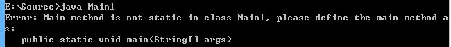
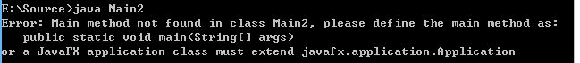
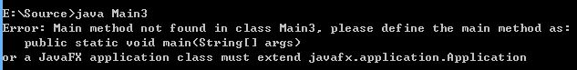
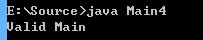
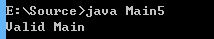
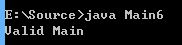
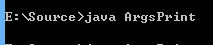
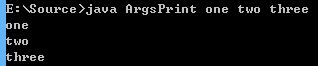

## 1.3 Java主函数入口

### __代码清单__
包：`com.sco._1st` 
类清单： 

* `Main1` (default package)
* `Main2` (default package)
* `Main3` (default package)
* `Main4` (default package)
* `Main5` (default package)
* `Main6` (default package)
* `ArgsPrint` (default package)

### __基本概念__

#### 1. __主函数入口__
一个可运行的Java程序必须包含一个程序入口，而Java语言中程序入口的签名会存在很多中形式，这个章节一一讨论对应的主函数入口程序，在讨论之前先看一些例子：（*：需要注意的是这个章节讨论的主函数主要针对Java Application，也就是说一些比较特殊的应用并不是以此章节讨论的主函数入口启动，例如JavaFx Application，Java Applet等。）

`public void main(String args[])` 
 

`static void main(String args[])` 
 

`public static void main(String args)` 
 

`public final static void main(String args[])` 
 

`public synchronized static void main(String args[])` 
 

`public strictfp static void main(String args[])` 
 

上边总共有六个例子，分别对应不同的main函数入口，先看看JVM针对main函数的修饰符不合法的错误信息： 
*Illegal modifier for the method main; only public, protected, private, abstract, static, final, synchronized, native & strictfp are permitted *
Java中可以用来修饰方法的关键字包括：public, protected, private, abstract, static, final, synchronized, native, strictfp，但主函数入口是十分严谨的，必须符合一定的规范才能被JVM识别并且找到。Java的主函数入口遵循下边的规范： 

* 针对main函数，static, void, public是必须的修饰符；
* 方法名必须是`main`，不可以是其他名字；
* 参数类型必须是`String[]`类型；
* 在上边必须的修饰符之上，还可以使用的修饰符是final, synchronized, strictfp三个；

访问控制修饰符？ 
Java语言主要包含了四种访问控制修饰符（具体后边会讲）：public, protected, private, (default)，针对主函数入口而言只能使用public的访问控制修饰符。

abstract和native为什么不行？ 
当然abstract和native两个关键字是可以修饰Java中的方法的，但abstract和native中的方法是有限制的，不能包含方法体`{}`，而主函数入口必须拥有方法体，所以这两个修饰符也是不能使用的。

final, synchronized, strictfp为什么可以？ 
这三个关键字在Java中修饰方法的时候具有特殊含义，他们的出现不影响JVM判断主函数入口，所以即使加了这些关键字不影响主函数入口的定义。

#### 2. __主函数参数__

主函数入口的参数类型是`String[]`，即一个字符串类型的数组，如何处理输入呢？看下边两个截图： 
不带参数运行： 

带参数运行： 

* args[0] = one
* args[1] = two
* args[2] = three
* 参数长度为3：args.length = 3

*：上述主函数的形参名为args，这里args是可以随意变化的，不影响，只是一种约定束成。

### __实验__
目的：理解Java主函数入口 
环境：非Eclipse环境

* 实验1：书写Main1 ~ Main6并且编译看结果
* 实验2：体会主函数的参数

（*：因为上边已经存在了实验的截图，内容略。）
