## 1.13 Java中的Array

### __代码清单__
包：`com.sco.jni` 
源代码清单： 

* `src/main/java/com/sco/jni/MemoryAddress.java`
* `src/main/java/com/sco/jni/com_sco_jni_MemoryAddress.h`
* `src/main/java/com/sco/jni/jni_MemoryAddressImpl.c`
* `jni/dll/memoryAddress.dll`
* `jni/dll/jni.h` (JDK自带)
* `jni/dll/jni_md.h`（JDK自带，Windows版）
* `jni/dll/jawt_md.h`（JDK自带，Windows版）

### __基本概念__
上一个章节学习了Array的基础知识，本章节主要展开讨论和Array相关的话题，首先看看JVM中关于一维数组和二维数组的概念存储模型。

#### __1.概念模型__

1）一维数组

	int arr[] = new int[3];

2）二维数组

	int[ ][ ] arr = new int[3][ ];
	arr[0] = new int[3];
	arr[1] = new int[5];
	arr[2] = new int[4];

3）Java中的对象（本章节主要分析和数组相关的内容，关于Java对象的Memory结构会在以后说明！）

	class A {
		int x;
		int y;
	}
 
	...
 
	public void m1() {
		int i = 0;
		m2();
	}
 
	public void m2() {
		A a = new A();
	}

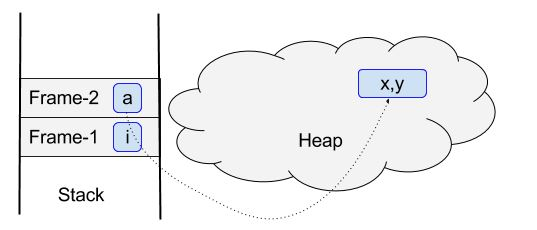

#### __2.深入分析Array__
Java中有八个基本类型：boolean, char, byte, short, int, long, float, double，在第一章学习的时候还学习了JVM中的reference和returnAddress两个不可见的基本类型，这些内容在JVM中又是如何定义的呢？先补充点知识。

【补充】：

__(1) 关于C语言中`typedef`的用法。__ 
`typedef`是C语言中的一种高级数据特性，它使得您能够为某一类型创建自己的名字。在这个方面和`#define`有点点像，但二者有3个明显的不同点：

* 和#define不一样，typedef给出的符号名称仅仅限于对类型，而不是对值；
* typedef的解释是由编译器执行，而不是进行预处理；
* 虽然它们的范围有限，但在其受限范围内，typedef比#define更加灵活；

`typedef`的使用如下

	typedef unsigned char BYTE;
	typedef struct complex {
		float real;
		float imag;
	} COMPLEX;
	BYTE x, y[10], *z; // 在这里x，y[10]，*z的类型都是unsigned char类型，因为BYTE相当于unsigned char的符号缩写

__(2) C语言中的特殊声明__，注释中P表示指针数量，RP表示返回值指针数：

	int matrix[8][8];			// int 数组的数组
	int ** ptr;					// P=1：指向int 的指针的指针
	int * risks[10];			// P=10：具有10个元素的数组，每个元素都是指向int的指针
	int (* rusks)[10];			// P=1：一个指针，指向具有10个元素的int数组
	int * oof[3][4];			// P=12：一个3 x 4的数组，每个元素都是一个指向int的指针
	int (* uuf)[3][4];			// P=1：一个指针，指向3 x 4的int数组
	int (* uof[3])[4];			// P=15：一个具有3个元素的数组，每个元素是一个指向具有4个元素int数组的指针
	
	char * fump();				// RP=1：返回指向char的指针的函数
	char (* frump)();			// RP=1：指向返回值为char的函数的指针
	char (* flump[3])();		// RP=3：三个指针组成的数组，每个指针指向返回类型为char的函数
	// 使用typedef建立系列相关类型
	typedef int arr5[5];
	typedef arr5 * p_arr5;
	typedef p_arr5 arrp10[10];
	arr5	togs;				// togs是具有5个元素的int数组
	p_arr5	p2;					// p2是一个指针，指向具有5个元素的int数组
	arrp10	ap;					// ap是具有10个元素的指针数组，每个指针指向具有5个元素的int数组

__（3）关于特殊声明中的规则__：

* 表示一个数组的`[]`和表示函数的`()`具有相同优先级，这个优先级高于运算符`*`： 
`int * risks[10];` 表示一个指针数组，而不是一个指向数组的指针；
* `[]`和`()`都是从左到右的结合： 
`int goods[12][50];` 表示由12个具有50个int值的数组构成的数组，不是一个由50个具有12个int构成的数组；
* `[]`和`()`具有相同优先级： 
`int (* rusks)[10];` 因为在方括号之前先使用了*和rusks组合，所以表示rusks是一个指向具有10个int值的数组的指针；

看完了关于类型的特殊声明，思考下边几个问题： 
1）“函数指针”和“指针函数”的区别？ 
2）“数组指针”和“指针数组”的区别？ 

__（4）关于Union__： 
联合（Union）是一个能在同一个存储空间里（但不同时）存储不同类型数据的数据类型。一个典型的应用是一种表，设计它是用来以某种既没有规律、事先也未知的顺序保存混合数据类型。使用联合类型的数组，可以创建相同大小单元的数组，每个单元都能存储多种类型的数据。

	union hold {
		int digit;
		double bigfl;
		char letter;
	};

Union只能存储一个值，所以初始化的规则和结构的初始化不同，具体讲有三种选择：

* 可以把一个Union初始化为同样类型的另一个联合；
* 可以初始化联合的第一个元素；
* 按照C99的标准，可以使用一个指定的初始化项目；

__（5）关于struct（C语言和C++的使用有区别）：__ 
结构声明（structure declaration）是描述结构如何组合的主要方式：

	struct PERSON {
		char title[MAXTITL];
		char author[MAXAUTL];
		float value;
	};
上述代码中声明了一个由两个字符数组和一个float变量组成的结构，它并没有创建一个实际的数据对象（和class一致），而是描述了组成这类对象的元素（有时候结构声明也称为模板，因为它勾勒了数据应该如何存储。）

C和C++的区别：

* C++里，结构体（structure）相同于类（class），除了它的成员（members）被默认为共有（public），类的成员默认为私有（private）；
* 在C里，必须明确使用struct关键字声明一个结构体（structure），在C++中，一旦类型定义过后不需要这样做了；
* 结构体类型被定义后，可以在封闭花括号和分号之间放置一个或者多个逗号分隔的变量名来声明变量；
* 结构体变量可以被初始化，但需要在花括号之内完成；

使用区别演示：

	int main(){
		struct PERSON sister;		// C 语言对PERSON结构的使用；
		PERSON brother;				// C++ 中对PERSON结构的使用；
	}
C++中的结构是针对C语言中的结构进行的补充，它已经不再是一个单纯的包含不同数据类型的数据结构了，它已经拥有了更多的功能： 
1）struct能包含成员函数； 
2）struct能实现继承； 
3）struct能实现多态；

__（6）C++中的struct和class__

* 默认的继承访问权限：struct是public，class是private；
* struct是数据结构的实现体，它本身定义的成员访问控制是public；class则是对象的实现体，它默认成员访问控制是private；
* class这个关键字还用于定义模板参数，类似“typename”，但struct不能用于定义模板参数；

##### __2.1.JVM中的Array类型__
看看下边的代码段：

*基本类型：跨操作系统部分* ( Jni.h )

	typedef unsigned char   jboolean;
	typedef unsigned short  jchar;
	typedef short           jshort;
	typedef float           jfloat;
	typedef double          jdouble;
	typedef jint            jsize;
*基本类型：Windows特有* ( Jni_mh.h )

	typedef long 			jint;
	typedef __int64 		jlong;
	typedef signed char 	jbyte;

*基本类型：Solaris特有* ( Jni_mh.h )

	typedef int jint;
	#ifdef _LP64 /* 64-bit Solaris */
	typedef long jlong;
	#else
	typedef long long jlong;
	#endif
	typedef signed char jbyte;

*复杂类型*

	class _jobject {};
	class _jclass : 		public _jobject {};
	class _jthrowable : 	public _jobject {};
	class _jstring : 		public _jobject {};
	class _jarray : 		public _jobject {};
	class _jbooleanArray : 	public _jarray {};
	class _jbyteArray : 	public _jarray {};
	class _jcharArray : 	public _jarray {};
	class _jshortArray : 	public _jarray {};
	class _jintArray : 		public _jarray {};
	class _jlongArray : 	public _jarray {};
	class _jfloatArray : 	public _jarray {};
	class _jdoubleArray : 	public _jarray {};
	class _jobjectArray : 	public _jarray {};

阅读过【补充】知识点过后，上边的定义就不难了，看看JVM中针对object和array的类型定义图： 
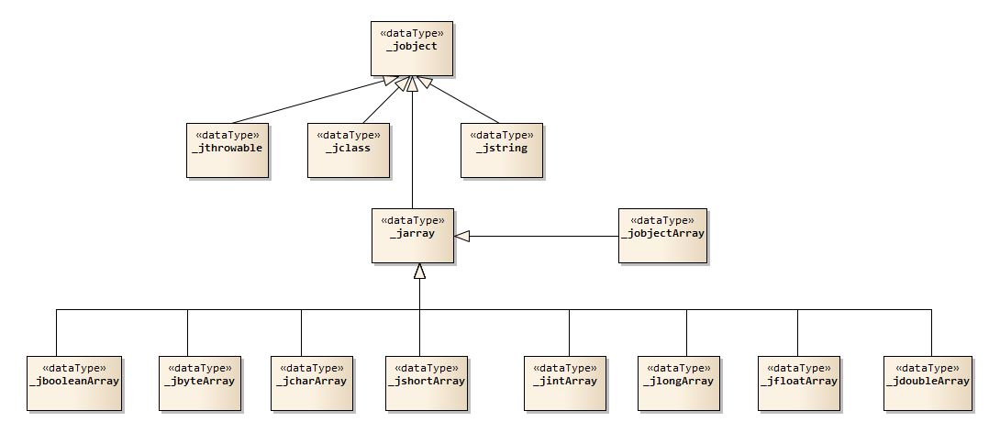
 Java语言中常常提到*Everything is an object !*，从图中的定义可以看出来； 
先简单总结一下：

* 针对这5个基本类型：`jboolean, jchar, jshort, jfloat, jdouble`这五个类型具有平台无关性；
* 针对另外3个：`jint, jlong, jbyte`这三个类型在Windows, Solaris系统中有些差异；
* `_jobject`是JVM中的顶级class，它有四个直属子类：`_jstring, _jclass, _jthrowable, _jarray`；
* `_jarray` 是JVM中的用于描述Array的类，它有九个子类，除了针对8个基本类型的类以外，还有一个特殊的`_jobjectArray`用于描述“对象数组”，最开始接触java的人都会觉得基本类型的数组使用的是同样的存储结构，实际上从底层的类结构看起来每一种基本类型的数组其结构上会有一定的差异。

看看下边的代码：

	int a10[] = {1,4,5,67};
	long a11[] = new long[11];
	a10 = (int[])a11; // Incorrect
	a11 = (long[])a10; // Incorrect

结合底层类型，`a10`的底层类型是`_jintArray`，而`a11`的类型是`_jlongArray`，Java中基于类的转型必须是有继承关系的，而`_jintArray`和`_jlongArray`属于兄弟节点，它们之间是不能进行转型的，即使一个`int`的数据和`long`数据之间可以进行强制转换，但这两个类型的数组之间不能进行强制类型转换。
##### __2.2.JVM中ArrayType实现__
JVM中Array类型的数据实现在`ArrayTypeImpl.c`文件中，这个章节来看看这个C语言文件中关于Java中Array的定义，这个文件中主要包含了4个`static`的函数：

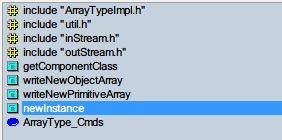

* getComponentClass：获取当前Array中元素的类型
* writeNewObjectArray：如果数组为对象数组，则将对象写入struct结构体：PacketOutputStream
* writeNewPrimitiveArray：如果数组为基本类型数组，则将基本类型数据写入struct结构体：PacketOutputStream
* newInstance：初始化一个Java的Array对象

##### __1）基本数据结构__

*PacketInputStream & PacketOutputStream*

在分析这三个函数之前先看看两个很特殊的结构体，上边的四个方法中都使用了这两个结构体作为参数：PacketInputStream和PacketOutputStream

*PacketInputStream结构*：

	typedef struct PacketInputStream {
    	jbyte *current;									// jbyte类型的指针，指向当前InputStream字节包
		jint left;										// jint类型指针，表示这个Stream左边待读取的字节包数据
    	jdwpError error;								// Java调试协议栈的错误信息，堆栈错误
    	jdwpPacket packet;								// Java调试协议栈中的数据包信息，堆栈数据
    	struct bag *refs;								// 当前字节包中的数据包引用指针【数据包本体】
	} PacketInputStream;

*PacketOutputStream结构*：

	typedef struct PacketOutputStream {
    	jbyte *current;									// jbyte类型的指针，指向当前OutputStream数据包									
    	jint left;										// jint类型指针，指向当前字节流左边的数据
    	struct PacketData *segment;						// PacketData类型的指针，指向某一段
    	struct PacketData firstSegment;					// PacketData类型的数据，表示第一段的数据
    	jvmtiError error;								// enum枚举类型jvmtiError，表示JVM级别的错误信息
    	jboolean sent;									// 标识当前字节包是否已经发送
    	jdwpPacket packet;								// Java调试协议中的数据包信息
    	jbyte initialSegment[INITIAL_SEGMENT_SIZE];		// 初始化输入字节包的分段信息
    	struct bag *ids;								// 当前字节包中的数据报结构体指针【数据包本体】
	} PacketOutputStream;

看了上边的注释部分基本已经理解了字节流“数据包“的基本概念，接下来再往下看两个里层的数据类型：

*bag*

	struct bag {
    	void *items;    /* 数据包中的数据项指针，该指针根据项大小itemSize进行对齐。 */
    	int used;       /* 当前数据包中数据项的总数 */
    	int allocated;  /* 保留的空间大小 */
    	int itemSize;   /* 数据包中每一项的大小 */
	};

*PacketData*

	typedef struct PacketData {
    	int length;					/* 数据包中的数据长度 */
    	jbyte *data;				/* 数据包中的数据指针，单个字节数据 */
    	struct PacketData *next;	/* 链表结构，指针指向下一个数据包的信息 */
	} PacketData;
针对上边的结构定义：

1. JVM用了ClassLoader加载类，而类是以.class字节码文件存储的，ClassLoader会动态加载字节码文件进行解释执行，执行的时候.class的字节码文件会以字节流的结构进行读/写操作，而字节流往下的结构如：字节流 -> 字节包 -> 字节数据（元数据则是数据项）
2. 字节数据在struct结构体PacketData中定义，它实现了一个“单链表”的数据结构，这个数据包保存了当前数据的长度，以及指向字节数据的指针；
3. struct结构体bag中定义了数据包的元数据信息，比如：包中有多少数据、数据项的数量、保留的空间大小、数据包中每一项的大小等。注意InputStream和OutputStream中关于bag的定义，并没有包含数据本身，而是结构指针； 这里简单介绍一下，JVM指令在执行字节码文件的时候会使用符号引用，实际上大部分时候这些数据结构中都没有保存数据值，都是使用指针的形式指向最终内存地址处的数据，从JVM字节码分析中可以知道，应该是指向了数据区，也就是汇编中的`.data`区域。上边的定义中有几个典型的指向数据区域的指针： 
1）PacketInputStream -> current：指向当前输入流结构； 
2）PacketInputStream -> refs：指向当前数据包的元数据结构体； 
3）PacketInputStream -> bag -> items：元数据结构体中指向元数据的数据项的位置； 
4）PacketOutputStream -> current：指向当前输出流结构； 
5）PacketOutputStream -> segment：输出流中数据包的段指针，指向输出流中某一数据段； 
6）PacketOutputStream -> PacketData -> data：输出流中分段数据的数据指针； 
7）PacketOutputStream -> ids：指向当前输出数据包中的元数据结构体； 
8）PacketOutputStream -> bag -> items：同3），只是针对的是输出字节流； 

总结一下：JVM在执行.class文件的时候的数据结构有如下的封装：

* 最小单元就是计算机的字节byte；
* 字节byte被封装成了PacketData的结构，这个结构是一个单链表，会操作某一块的数据区；
* 结构体bag中并不包含数据，元数据信息在编译完成过后就固定下来了；
* JVM执行过程主要是通过：InputStream -> segment -> OutputStream的模式，segment存在于OutputStream中类似于数据缓存；

##### __2）数组初始化——newInstance__
看完了和数据结构相关的内容，接下来看看Array的创建流程。

*函数签名*

	static jboolean newInstance(PacketInputStream *in, PacketOutputStream *out);

*函数体*

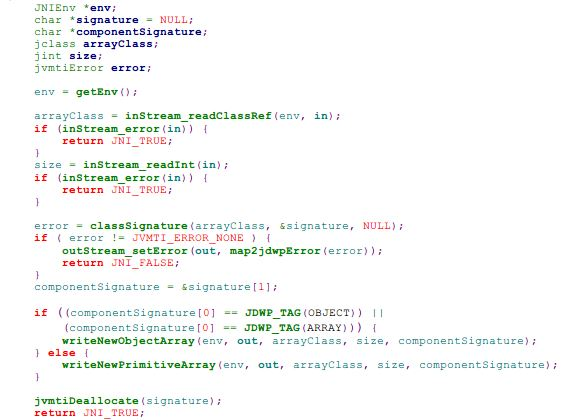

*流程*

（1）读取JVM的上下文环境信息（JNIEnv）

	env = getEnv();
（2）传入JVM的环境变量和输入流的指针，从字节流中读取数组类型信息（jclass）

	arrayClass = inStream_readClassRef(env, in);
（3）类型读取失败，返回JNI\_TRUE；

	if (inStream_error(in)) {
        return JNI_TRUE;
    }
（4）直接从字节流中读取当前Array的长度信息；

	size = inStream_readInt(in);
（5）长度读取失败，返回JNI_TRUE；

	if (inStream_error(in)) {
        return JNI_TRUE;
    }
（6）读取当前数组本身的类型签名信息；

	error = classSignature(arrayClass, &signature, NULL);
（7）如果读取失败，返回JNI_FALSE，并且丢出异常信息；

	if ( error != JVMTI_ERROR_NONE ) {
        outStream_setError(out, map2jdwpError(error));
        return JNI_FALSE;
    }
（8）从数组的地址第一个位置读取数组中元素的签名信息；

	componentSignature = &signature[1];
（9）如果读取的类型签名是OBJECT或者ARRAY，调用：`writeNewObjectArray`，如果读取的类型签名不是OBJECT和ARRAY，则调用：`writeNewPrimitiveArray`（这里应该看是_jobject类型还是_jarray类型）

	if ((componentSignature[0] == JDWP_TAG(OBJECT)) ||
        (componentSignature[0] == JDWP_TAG(ARRAY))) {
        writeNewObjectArray(env, out, arrayClass, size, componentSignature);
    } else {
        writeNewPrimitiveArray(env, out, arrayClass, size, componentSignature);
    }
（10）签名信息已经没有作用，释放签名信息的内存，初始化完成；

	jvmtiDeallocate(signature);
    return JNI_TRUE;

##### __3）元素类型获取__
本文就不去解析`writeNewObjectArray`和`writeNewPrimitiveArray`两个知道明显功能的方法了，再看看另外一个方法：`getComponentClass`，这个方法主要用于获取数组内元素的类型信息，会在`writeNewObjectArray`中被调用。

*函数签名*

	static jdwpError getComponentClass(JNIEnv *env, jclass arrayClass, char *componentSignature, jclass *componentClassPtr)

*函数体*

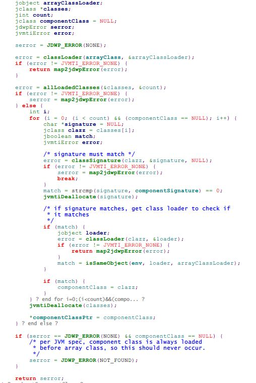

*流程*

（1）重设JDWP错误标记为NONE；

	serror = JDWP_ERROR(NONE);
（2）根据传入的元素的类型信息获取ClassLoader，若调用失败，直接返回jvmtiError；
	
	error = classLoader(arrayClass, &arrayClassLoader);
    if (error != JVMTI_ERROR_NONE) {
        return map2jdwpError(error);
    }
（3）获取已经被加载过的所有类信息：

	error = allLoadedClasses(&classes, &count);
（4）遍历所有得到的类信息，循环检查加载类信息：

	for (i = 0; (i < count) && (componentClass == NULL); i++) 
（5）针对每一个类进行签名匹配：

	/* signature must match */
    error = classSignature(clazz, &signature, NULL);
    if (error != JVMTI_ERROR_NONE) {
        serror = map2jdwpError(error);
        break;
    }
    match = strcmp(signature, componentSignature) == 0;
    jvmtiDeallocate(signature);
（6）如果签名匹配就调用类加载器：

	/* if signature matches, get class loader to check if it matches*/
    if (match) {
         jobject loader;
         error = classLoader(clazz, &loader);
         if (error != JVMTI_ERROR_NONE) {
             return map2jdwpError(error);
         }
         match = isSameObject(env, loader, arrayClassLoader);
    }

    if (match) {
         componentClass = clazz;
    }
\*：在类型加载完成过后有一句检查类加载器的过程，即：检查复杂元素类型的类加载器和父类数组本身的类加载器是不是同一个对象，如果是同一个对象证明数组和元素在同一个ClassLoader环境中，这样的情况才算绝对匹配。这个地方会引起Java中的一个异常的误解：ClassNotFoundException。下边几种情况都会导致这个异常：

1. JVM标准加载，从当前ClassLoader一直到父类的ClassLoader中都没有找到这个类
2. 两个类都存在，但被不同的ClassLoader加载（最后一个match检查的是这种情况，也是最容易被忽略的情况） 
`match = isSameObject(env, loader, arrayClassLoader);`

（7）释放内存，设置元素的类型指针

	jvmtiDeallocate(classes);
	*componentClassPtr = componentClass;

JVM中关于Array的实现部分就说这么多，接下来看看JVM中的Array对应的Reference的信息。

##### __2.3.JVM中ArrayReference实现__

__数组的强转__： 
在C语言中，针对基础类型可以直接进行数组的强制转换，姑且不说结果值对不对，因为指针可直接操作地址，只要根据类型长度从对应的地址空间去读写数据就可以直接将一个int[]类型的数组转成char[]类型。但是在Java里面却办不到，上边已经说过了，当int[] -> long[]的时候，JVM里面做的类型实际上是从_jintArray -> _jlongArray的转换，因为这两个类型违背了JVM规范中对象转型的描述，所以不能直接强制转换。

 
看了上边这个图，就可以回答一个问题了：Java中的Array存储的是什么？实际上就是reference，也就是引用，先看看JVM中Reference的实现部分的代码，最后回归讨论一下Array最终存储结构。

JVM中实现部分的代码位于`ArrayReferenceImpl.c`文件中，这个文件定义如下：

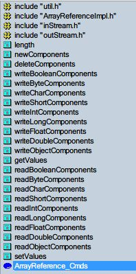 
这个类里面没有特殊的Struct结构体的内容，所以仅仅看看一些核心方法，对于write\*和read\*系列的方法只需要解析其中一个就足够了。

##### __1）引用初始化——newComponents__
看完了和数据结构相关的内容，接下来看看Array的创建流程。

*函数签名*

	static void * newComponents(PacketOutputStream *out, jint length, size_t nbytes)

*函数体*

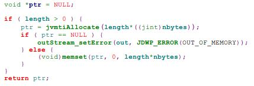

*流程* (代码短的就不一行一行解析了)

1. 判断数组长度；
2. 长度大于0就调用`jvmtiAllocate`进行内存分配；
3. 分配不成功抛出异常：OutOfMemory；
4. 分配成功则调用`memset`方法设置分配好的内存执行内存初始化；

##### __2）子类型元素写入——writeIntComponents__

*函数签名*

	static void writeIntComponents(JNIEnv *env, PacketOutputStream *out,
                    jarray array, jint index, jint length)

*函数体*

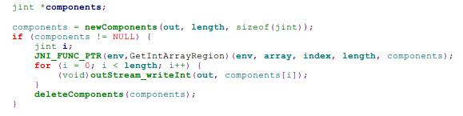

*流程*

1. 定义`jint`类型的指针，并且指向一个初始化的Array；
2. 在内存中获取当前int类型数组的范围；
3. 写入`PacketOutputStream`字节输出流；
4. 将引用指针释放；

##### __3）子类型元素读取——readComponents__

*函数签名*

	static jdwpError readIntComponents(JNIEnv *env, PacketInputStream *in,
                   jarray array, int index, int length)

*函数体*

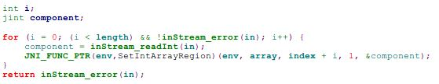

*流程*

1. 定义`jint`类型的指针和遍历索引i；
2. 从字节流中读取字节数据到`PacketInputStream`中；
3. 在内存中设置当前int类型的数组范围，即将读取数据放入内存；
4. 返回读取到的内容；

##### __4）元素读取——getValues__

*函数签名*

	static jboolean getValues(PacketInputStream *in, PacketOutputStream *out)

*函数体*

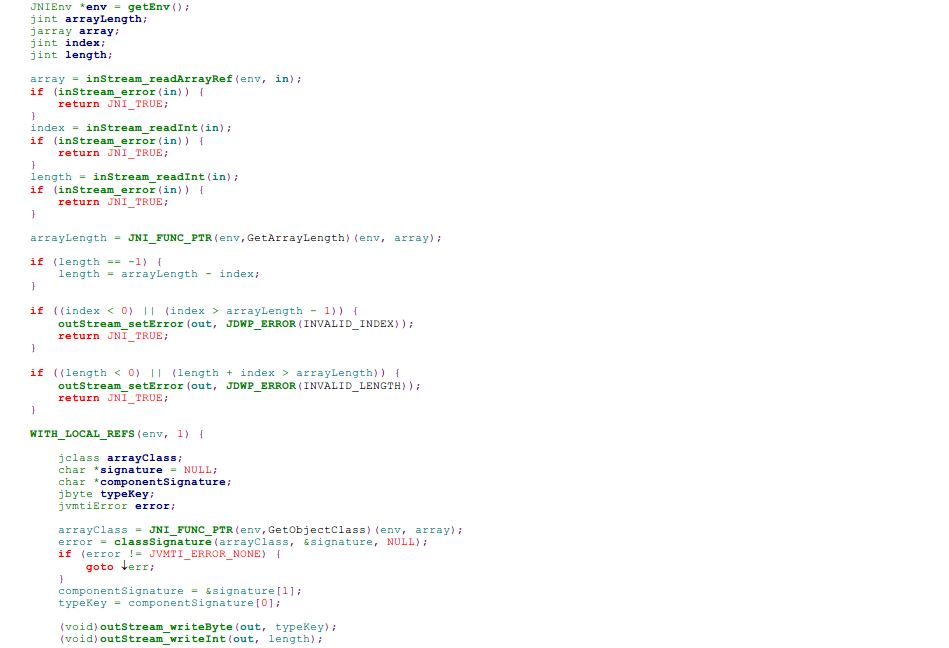
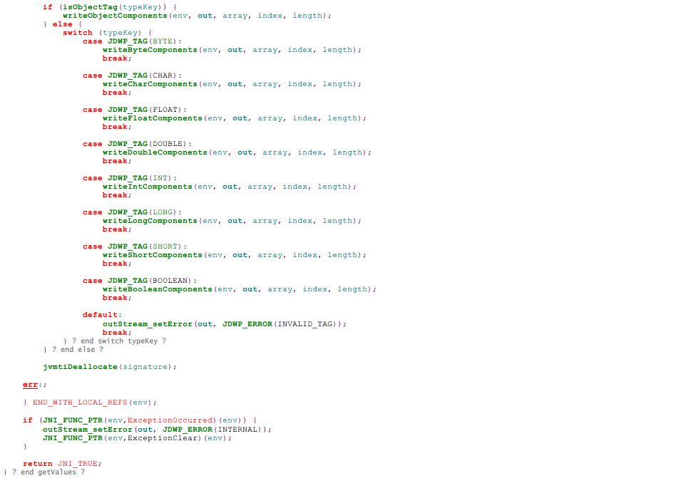

这个函数的流程就不详细说了，没有太大的难度，这里只需要注意两句：

    componentSignature = &signature[1];
    typeKey = componentSignature[0];

    (void)outStream_writeByte(out, typeKey);
    (void)outStream_writeInt(out, length);
这里是从字节流中读取对应的元素签名、并且从元素签名中读取元素的类型信息，然后按照`typeKey`和`length`的信息顺序写入到输出字节流对象中，通过这种方式，上层调用就会直接返回读取到的元素的信息，关于这个顺序在后边解析字节码结构的时候会提到。

##### __5）元素设置——setValues__

*函数签名*

	static jboolean setValues(PacketInputStream *in, PacketOutputStream *out)

*函数体*

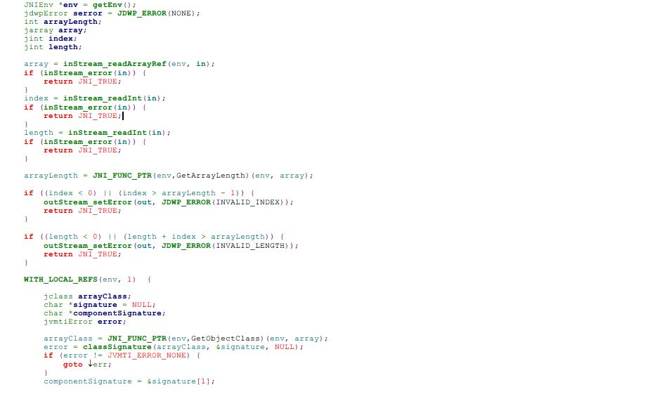
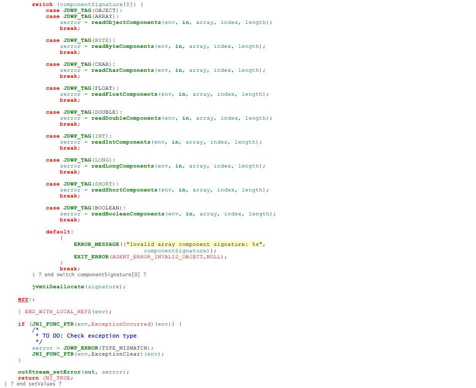

从上边的代码发现什么问题没有？getValues -> write, setValues -> read为什么呢？

1. 调用getValues的时候，`PacketOutputStream`意味着字节流有数据输出，并且输出的值将会返回到用户调用这边，所以字节流的方向为： 
`Memory -> PacketInputStream -> getValues -> PacketOutputStream -> <User>`
2. 调用setValues的时候，`PacketInputStream`会接受来自用户的输入，则字节流方向为： 
`<User> -> PacketInputStream -> setValues -> Memory`

通过上边的数据方向就可以理解两部分代码的详细内容了。

##### __2.4.JVM中Array对应的Memory存储结构__

这个小节需要讨论的实际上是“多维数组”的引用Reference的存储模型，在讨论JVM中的存储模型之前，先看看C语言中的多维数组的存储模型，先看两个例子：

C语言中的二维数组[ 3 x 5 ]：( Int ) 

C语言中的三位数组[ 3 x 3 x 3 ]：( Byte ) 

从打印的结果可以发现一个核心的地方：连续栈空间——也就是说，不论是多少维度的数组，在C语言中，每一个元素都独自占用了一个连续栈空间（图中为了区分，有同地址的值打印出来），从地址的值可以知道分配是连续的。那么JVM中的存储究竟会不会是下边的结构呢： 
 
参考下边的几个例子：

__*一维Char数组*__

	Random random = new Random();
	MemoryAddress memAddr = new MemoryAddress();
	// 1.Char地址空间
	char[] charArr = {'A','C','T','E'};
	memAddr.printAddress(charArr);

输出：

	[0] = 65 : 0x000000000241D9A0
	[1] = 67 : 0x000000000241D9A2
	[2] = 84 : 0x000000000241D9A4
	[3] = 69 : 0x000000000241D9A6
从上边的输出可以看到，Java中的一维地址使用的是线性地址，因为Java中的字符使用的是Unicode的值，在地址上运算一个变化表示一个字节，从前边的C语言中的截图已经知道了，Unicode是双字节，所以看上边的末尾：`A0`,`A2`,`A4`,`A6`是按照2个字节的梯度递增。为了验证这一点，看第二个例子：

__*一维Int数组*__

	// 2.Int地址空间
	int[] intArr = {12,34,56,77,99};
	memAddr.printAddress(intArr);

输出：

	[0] = 12 : 000000001E0D6F20
	[1] = 34 : 000000001E0D6F24
	[2] = 56 : 000000001E0D6F28
	[3] = 77 : 000000001E0D6F2C
	[4] = 99 : 000000001E0D6F30

上边两个例子已经验证了一个事实就是Java中的一维基本类型数组实际上使用的是线性地址，那么引起了另外一个问题： 
在C语言中，`int[]`类型不是对象，那么它实际上是存储在栈空间连续地址上的数据集，而Java中也是存储在栈空间？答案是：错！啊，那上边的输出？，JVM中的源代码中已经给出了答案：`_jarray`的父类是`_jobject`，而`_jobject`本身是C++中定义的一个class，也就是说Java中的数组不可能是栈空间存储的数组，而是使用经典的Java内存模型的从：栈引用 -> 堆对象的一个过程。堆空间的地址可以连续，也可以不连续，并非因为堆空间的地址是动态分配就一定是不连续的，所以上边两个例子和截图中的两个地址是有区别的，虽然梯度值都是一样的，但是有本质区别的，这就解释了下边的代码强制类型转换为什么在C语言可行，而Java中连编译器的编译都通不过。

	int a10[] = {1,4,5,67};
	long a11[] = new long[11];
	a10 = (int[])a11; // Incorrect

__*二维Int数组*__

继续深入实验去看看：构造两个二维Int数组，一个使用字面量的方式构造，一个使用new关键字：

	int[][] arrays1 = new int[3][4];
	for (int i = 0; i < arrays1.length; i++) {
		arrays1[i] = new int[4];
		for (int j = 0; j < arrays1[i].length; j++) {
			arrays1[i][j] = random.nextInt(50) + 10;
		}
	}
	int[][] arrays2 = { { 34, 76, 54, 67, 80 }, { 55, 56, 76, 80 },
			{ 90, 87, 86, 11, 23 },
			{ 33, 67, 58, 90, 77, 11, 23, 45, 80, 90 } };

这里提前看看JVM构造对象的方式，既然说Array是对象：

* 如果使用new的方式构造，那么JVM会直接在内存中申请堆空间的内存初始化对象；
* 如果使用字面量的方式构造，那么JVM会先检索常量池，然后根据常量池检索结果决定初始化对象的方式；

`arrays1`的构造方式是使用的new关键字，看看它的输出：

Java部分：

	Matrix -> 
	[40],[39],[16],[10],
	[40],[54],[43],[45],
	[40],[38],[56],[46],

JNI部分（C语言输出，Java中的Native Interface）：

	length => 3
	[0] : 0x000000001C2C8EC0
	length => 4
	[0][0] = 40 : 0x000000001E3F6D90
	[0][1] = 39 : 0x000000001E3F6D94
	[0][2] = 16 : 0x000000001E3F6D98
	[0][3] = 10 : 0x000000001E3F6D9C
	[1] : 0x000000001C2C8ED0
	length => 4
	[1][0] = 40 : 0x000000001E3F7070
	[1][1] = 54 : 0x000000001E3F7074
	[1][2] = 43 : 0x000000001E3F7078
	[1][3] = 45 : 0x000000001E3F707C
	[2] : 0x000000001C2C8EE0
	length => 4
	[2][0] = 40 : 0x000000001E3F6E90
	[2][1] = 38 : 0x000000001E3F6E94
	[2][2] = 56 : 0x000000001E3F6E98
	[2][3] = 46 : 0x000000001E3F6E9C

从上边的例子可以知道：第二个维度的地址空间各自连续，如从`[0][0]`到`[0][3]`的地址从90 -> 9C，因为是int类型，所以地址梯度是4，而且数据值和Java中传入的数据值是匹配的，第一个二维空间的地址是连续的，因为使用的是new关键字，那么`[0]`，`[1]`，`[2]`三个不同的二维空间的地址都是各自连续的，而且是在堆空间申请的地址，这个符合Java的语言规范，但是这个例子证明不了JVM中的数组的结构，需要使用一个反例来证明上边截图中的存储空间结构，为什么呢？因为这里的每一个维度使用了下边的语句申请空间：

	arrays1[i] = new int[4];
也就是说`[0]`，`[1]`，`[2]`三个维度的各自不连续本来就是代码在使用了new过后导致的结果，因为每一个第二维度都使用了new关键字，所以导致的结果是这三个空间本来就应该不连续，最后看看`arrays2`的结果：

Java部分：

	Matrix -> 
	[34],[76],[54],[67],[80],
	[55],[56],[76],[80],
	[90],[87],[86],[11],[23],
	[33],[67],[58],[90],[77],[11],[23],[45],[80],[90],

JNI部分：

	length => 4
	[0] : 0x000000001C2C8EC0
	length => 5
	[0][0] = 34 : 0x000000001E3F6EB0
	[0][1] = 76 : 0x000000001E3F6EB4
	[0][2] = 54 : 0x000000001E3F6EB8
	[0][3] = 67 : 0x000000001E3F6EBC
	[0][4] = 80 : 0x000000001E3F6EC0
	[1] : 0x000000001C2C8ED0
	length => 4
	[1][0] = 55 : 0x000000001E3F6DB0
	[1][1] = 56 : 0x000000001E3F6DB4
	[1][2] = 76 : 0x000000001E3F6DB8
	[1][3] = 80 : 0x000000001E3F6DBC
	[2] : 0x000000001C2C8EE0
	length => 5
	[2][0] = 90 : 0x000000001E3F7170
	[2][1] = 87 : 0x000000001E3F7174
	[2][2] = 86 : 0x000000001E3F7178
	[2][3] = 11 : 0x000000001E3F717C
	[2][4] = 23 : 0x000000001E3F7180
	[3] : 0x000000001C2C8EF0
	length => 10
	[3][0] = 33 : 0x000000001E33DB70
	[3][1] = 67 : 0x000000001E33DB74
	[3][2] = 58 : 0x000000001E33DB78
	[3][3] = 90 : 0x000000001E33DB7C
	[3][4] = 77 : 0x000000001E33DB80
	[3][5] = 11 : 0x000000001E33DB84
	[3][6] = 23 : 0x000000001E33DB88
	[3][7] = 45 : 0x000000001E33DB8C
	[3][8] = 80 : 0x000000001E33DB90
	[3][9] = 90 : 0x000000001E33DB94

基本上到这个位置就可以给出总结了，上边那个图中的结构是对的，即使使用了字面量的构造方式，最终输出的结果也是单独的二维连续，而各自保持独立的堆空间地址。根据上边的两个C语言的实验和四个JNI的实验可得出最终的总结结果了，而JVM中的Array的Memory存储也一目了然。

一维数组的空间已经验证过了，这里不需要再去验证上边的结构，为了验证其他维度的地址空间，看看下边的代码：

	int[][][][] tuple = {
				{ { { 11, 45, 13, 16 }, { 12, 44, 46, 55 }, { 13, 33, 56, 14 } } },
				{ { { 11, 45, 13, 16 }, { 12, 44, 46, 55 }, { 13, 33, 56, 14 } } },
				{ { { 11, 45, 13, 16 }, { 12, 44, 46, 55 }, { 13, 33, 56, 14 } } },
				{ { { 11, 45, 13, 16 }, { 12, 44, 46, 55 }, { 13, 33, 56, 14 } } },
				{ { { 11, 45, 13, 16 }, { 12, 44, 46, 55 }, { 13, 33, 56, 14 } } } };
	MemoryAddress memAddr = new MemoryAddress();
	memAddr.printAddress(tuple);
上边定义了一个规则的的四维数组，看看地址打印结果：

	         [0] : 0x0000000039800A80
	      [0][0] : 0x0000000039800A88
	   [0][0][0] : 0x0000000039800A90
	[0][0][0][0] : 0x000000003BF16E70 ( 11 )
	[0][0][0][1] : 0x000000003BF16E74 ( 45 )
	[0][0][0][2] : 0x000000003BF16E78 ( 13 )
	[0][0][0][3] : 0x000000003BF16E7C ( 16 )
	   [0][0][1] : 0x0000000039800AA0
	[0][0][1][0] : 0x000000003BF16F90 ( 12 )
	[0][0][1][1] : 0x000000003BF16F94 ( 44 )
	[0][0][1][2] : 0x000000003BF16F98 ( 46 )
	[0][0][1][3] : 0x000000003BF16F9C ( 55 )
	   [0][0][2] : 0x0000000039800AB0
	[0][0][2][0] : 0x000000003BF17130 ( 13 )
	[0][0][2][1] : 0x000000003BF17134 ( 33 )
	[0][0][2][2] : 0x000000003BF17138 ( 56 )
	[0][0][2][3] : 0x000000003BF1713C ( 14 )
	         [1] : 0x0000000039800AB0
	      [1][0] : 0x0000000039800AB0
	   [1][0][0] : 0x0000000039800AB8
	[1][0][0][0] : 0x000000003BF16CD0 ( 11 )
	[1][0][0][1] : 0x000000003BF16CD4 ( 45 )
	[1][0][0][2] : 0x000000003BF16CD8 ( 13 )
	[1][0][0][3] : 0x000000003BF16CDC ( 16 )
	   [1][0][1] : 0x0000000039800AC8
	[1][0][1][0] : 0x000000003BF171D0 ( 12 )
	[1][0][1][1] : 0x000000003BF171D4 ( 44 )
	[1][0][1][2] : 0x000000003BF171D8 ( 46 )
	[1][0][1][3] : 0x000000003BF171DC ( 55 )
	   [1][0][2] : 0x0000000039800AD8
	[1][0][2][0] : 0x000000003BF16F10 ( 13 )
	[1][0][2][1] : 0x000000003BF16F14 ( 33 )
	[1][0][2][2] : 0x000000003BF16F18 ( 56 )
	[1][0][2][3] : 0x000000003BF16F1C ( 14 )
	         [2] : 0x0000000039800AE0
	      [2][0] : 0x0000000039800AD8
	   [2][0][0] : 0x0000000039800AE0
	[2][0][0][0] : 0x000000003BF16B50 ( 11 )
	[2][0][0][1] : 0x000000003BF16B54 ( 45 )
	[2][0][0][2] : 0x000000003BF16B58 ( 13 )
	[2][0][0][3] : 0x000000003BF16B5C ( 16 )
	   [2][0][1] : 0x0000000039800AF0
	[2][0][1][0] : 0x000000003BF17110 ( 12 )
	[2][0][1][1] : 0x000000003BF17114 ( 44 )
	[2][0][1][2] : 0x000000003BF17118 ( 46 )
	[2][0][1][3] : 0x000000003BF1711C ( 55 )
	   [2][0][2] : 0x0000000039800B00
	[2][0][2][0] : 0x000000003BF171F0 ( 13 )
	[2][0][2][1] : 0x000000003BF171F4 ( 33 )
	[2][0][2][2] : 0x000000003BF171F8 ( 56 )
	[2][0][2][3] : 0x000000003BF171FC ( 14 )
	         [3] : 0x0000000039800B10
	      [3][0] : 0x0000000039800B00
	   [3][0][0] : 0x0000000039800B08
	[3][0][0][0] : 0x000000003BF16D10 ( 11 )
	[3][0][0][1] : 0x000000003BF16D14 ( 45 )
	[3][0][0][2] : 0x000000003BF16D18 ( 13 )
	[3][0][0][3] : 0x000000003BF16D1C ( 16 )
	   [3][0][1] : 0x0000000039800B18
	[3][0][1][0] : 0x000000003BF17210 ( 12 )
	[3][0][1][1] : 0x000000003BF17214 ( 44 )
	[3][0][1][2] : 0x000000003BF17218 ( 46 )
	[3][0][1][3] : 0x000000003BF1721C ( 55 )
	   [3][0][2] : 0x0000000039800B28
	[3][0][2][0] : 0x000000003BF16DD0 ( 13 )
	[3][0][2][1] : 0x000000003BF16DD4 ( 33 )
	[3][0][2][2] : 0x000000003BF16DD8 ( 56 )
	[3][0][2][3] : 0x000000003BF16DDC ( 14 )
	         [4] : 0x0000000039800B40
	      [4][0] : 0x0000000039800B28
	   [4][0][0] : 0x0000000039800B30
	[4][0][0][0] : 0x000000003BF16E90 ( 11 )
	[4][0][0][1] : 0x000000003BF16E94 ( 45 )
	[4][0][0][2] : 0x000000003BF16E98 ( 13 )
	[4][0][0][3] : 0x000000003BF16E9C ( 16 )
	   [4][0][1] : 0x0000000039800B40
	[4][0][1][0] : 0x000000003BF16EB0 ( 12 )
	[4][0][1][1] : 0x000000003BF16EB4 ( 44 )
	[4][0][1][2] : 0x000000003BF16EB8 ( 46 )
	[4][0][1][3] : 0x000000003BF16EBC ( 55 )
	   [4][0][2] : 0x0000000039800B50
	[4][0][2][0] : 0x000000003BF16BD0 ( 13 )
	[4][0][2][1] : 0x000000003BF16BD4 ( 33 )
	[4][0][2][2] : 0x000000003BF16BD8 ( 56 )
	[4][0][2][3] : 0x000000003BF16BDC ( 14 )

上边结果很混乱看不出来详细的内容，这里把最后一个维度的对象地址抽掉就成了下边的结果：

	         [0] : 0x0000000039800A80
	      [0][0] : 0x0000000039800A88
	   [0][0][0] : 0x0000000039800A90
	   [0][0][1] : 0x0000000039800AA0
	   [0][0][2] : 0x0000000039800AB0
	         [1] : 0x0000000039800AB0
	      [1][0] : 0x0000000039800AB0
	   [1][0][0] : 0x0000000039800AB8
	   [1][0][1] : 0x0000000039800AC8
	   [1][0][2] : 0x0000000039800AD8
	         [2] : 0x0000000039800AE0
	      [2][0] : 0x0000000039800AD8
	   [2][0][0] : 0x0000000039800AE0
	   [2][0][1] : 0x0000000039800AF0
	   [2][0][2] : 0x0000000039800B00
	         [3] : 0x0000000039800B10
	      [3][0] : 0x0000000039800B00
	   [3][0][0] : 0x0000000039800B08
	   [3][0][1] : 0x0000000039800B18
	   [3][0][2] : 0x0000000039800B28
	         [4] : 0x0000000039800B40
	      [4][0] : 0x0000000039800B28
	   [4][0][0] : 0x0000000039800B30
	   [4][0][1] : 0x0000000039800B40
	   [4][0][2] : 0x0000000039800B50
从上边的图可以看出，虽然四维数组的底层数据维度（第四维）在不同的内存空间，但非数据维度（仅仅存引用，第一维 ~ 第三维）都是存储在一块连续地址上的，这里只看后三位来进行分析：\*：注意这里的`[0]`表示的实际是`[i][x][x][x]`的起始地址

先一个维度一个维度地看：

* `[0][x][x] ~ [4][x][x]`：这些地址分别为： 
`A80, AB0, AE0, B10, B40`，这个是一个等差数列，它们之间的差值为：30，也就是十进制的48；
* `[0][0][x] ~ [4][0][x]`：这些地址分别为： 
`A88, AB0, AD8, B00, B28`，这个地址也是一个等差数列，它们之间的差值为：28，也就是十进制的40；
* `[0][0][0] ~ [4][0][2]`：这些地址分别为： 
`A90, AA0, AB0, AB8, AC8, AD8, AE0, AF0, B00, B08, B18, B28, B30, B40, B50`：这个地址虽然不是等差数列，但当第一位变化的时候，每一个子维度下边的差值是10，也就是十进制的16；

那么先设置一个线性的堆空间（Java中Array不会存储在栈空间）

	A80		// [0][x][x]							【1】
    A88		// [0][0][x]									【2】
    A90		// [0][0][0]											【3】
    A98     
	AA0		// [0][0][1]											【3】
	AA8		
	AB0		// [0][0][2], [1][x][x], [1][0][x]		【1】	   【2】	 【3】
	AB8		// [1][0][0]											【3】
	AC0		
	AC8		// [1][0][1]											【3】
	AD0
	AD8		// [1][0][2], [2][0][x]							【2】				
	AE0		// [2][x][x], [2][0][0]					【1】			   【3】
	AE8		
	AF0		// [2][0][1]											【3】
	AF8
	B00		// [2][0][2], [3][0][x],						【2】    【3】
	B08     // [3][0][0]											【3】
	B10		// [3][x][x]							【1】
	B18		// [3][0][1]											【3】
	B20
	B28		// [3][0][2], [4][0][x]							【2】    【3】
	B30		// [4][0][0]											【3】
	B38
	B40		// [4][x][x], [4][0][1]					【1】			   【3】
	B48
	B50		// [4][0][2]											【3】

注意上边的维度标记【1】【2】【3】，有了这个维度标记后，这个线性空间的引用存储就完全一目了然了。（*：这个例子中的i, j, m, n中j的只有一个值，所以`[i][j][m][n]`中除去底层维度n过后，j永远不可能是1。）

* 对于四维数组而言，底层维度因为是存储在另外的堆空间中，那么上边结果可以看到“线性表”中的前三维的存储方式。
* 这里的地址梯度和JVM中的内置类型`reference`有关，因为使用的是64bit的JDK，所以`reference`占用的地址空间是8（*：Java的对象数组中存储的都是reference），如果是32bit的JDK，`reference`占用的地址是4（已经验证）。
* 上一个维度的末指针和下一个维度的初始指针要么重叠，要么相邻： 
`[0][0][2] -> [1][x][x]` 
`[1][0][2] -> [2][x][x]` 
`[2][0][2] -> [3][0][x]` 
`[3][0][2] -> [4][0][x]` 

从最终的存储地址的线性空间可以看到，最后一个元素梯度刚好是`16`，看看下边的测试数据就理解了。 
64bit的最终Array对象引用空间梯度： 
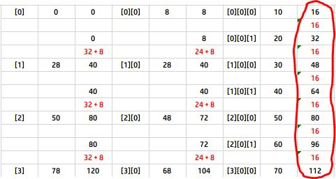 
32bit的最终Array对象引用空间梯度： 
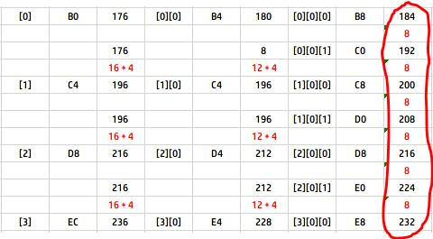 

从上边的例子可以知道，除了最底层数据维度是存储在非连续的堆空间中，而所有的非数据维度实际上在内存中是以连续的堆空间存储的，除了连续存储以外，还伴随一定的线性数据结构，比如：上一个维度的末指针和下一个维度的初始指针的连接，最后一个元素的空间压缩，各自维度在线性空间分布的“等差”特性，从上边的地址数据最终测试结果都可以得到。

##### __2.5.总结__
这个章节没有任何练习实验，主要目的是理解：Java中的Array的Memory存储结构：

1. Java中的Array类型底层实现使用的是C++中OO部分的class，它的父类是_jobject，本身为_jarray，而所有Java里面的基本类型都有独自的class对应，_jarray的9个子类为： 
`_jintArray, _jbyteArray, _jshortArray, _jlongArray, _jcharArray, _jbooleanArray, _jfloatArray, _jdoubleArray, _jobjectArray`
2. C语言中的`int[]`和Java中的`int[]`从输出上看来内容是一致的，但本质存储上有很大的区别，C语言中的`int[]`是直接在栈空间中分配连续地址用来存储基本类型，而Java从一维数组开始就直接使用了：reference -> Object的结构在存储Array，它的每一个维度的信息在堆空间是连续的，也就是说Java中的数据从最初分配地址的时候就直接在堆空间申请对象的存储空间信息，在栈中保存的仅仅是：当前数组本身的唯一引用，这也证明了另外一个事实：Java中的引用并非全部存储在栈空间，多维数组从第一个维度的引用开始都是存储在连续的堆空间的引用。
3. Java中的多维从表面现象看来大量使用了“链表”的结构在存储，从第二个维度开始就出现了“链表”结构，准确地说是基于链表的数组的数组。
4. Java中的二维数组正确说应该是：数组的数组，从实验结果可以知道，不论是使用new操作符，还是使用非new的字面量的方式初始化，其最终在Memory中的结果都能描述这样的一个结构，也就是说：Java中的Array是对象，并非基本类型，即使它的元素是基本类型比如`int[]`或者`char[]`，但构成的Array却是对象；
5. Java中的数组比起C语言中的数组多了很多元数据信息：如果数组元素直接存储在栈空间，是没有额外的空间可存储元数据信息的，而Java里保存了当前数组的信息（源码中可知）：数组的长度（元素的个数），数组本身的类型签名，数组元素的类型签名等各种信息；

上一个章节讨论了Java中的Array的列遍历、行遍历，那么从目前得到的结构看来，Java语言默认的方式是列遍历方式，也就是深度检索算法，并非广度检索，如果一定要使用广度检索的方式进行行遍历，那么从Memory级别可以发现指针的运动轨迹会付出高昂的代价（维度越大其代价越明显），纵然可以使用循环的方式得到正确结果，但有可能会导致Performance上的开销，虽然现在的硬件平台基本忽略这种级别的开销，但从计算机的角度上讲：行遍历会比列遍历（默认）的方式增加遍历的开销；如果不使用遍历的方式，提供了i和j的值的时候，JVM完全可以通过单向路径进行遍历，其指针移动轨迹和C语言中的指针移动轨迹都属于线性轨迹，其Performance一致（当然因为JVM中的Array是对象，虽然检索的距离是相等的，但Java还是要比C语言中的遍历的开销要大）。

	