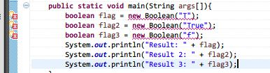

## 1.14 Java中的Boolean和boolean

### __代码清单__
包：`com.sco._1st` 
类清单： 

* `com.sco._1st.BooleanLiteral`
* `com.sco._1st.BooleanTester`
* `com.sco._1st.GetBooleanTester`
* 

### __基本概念__

#### __1.两个欺骗__

##### __1.1.关于构造函数__
Java中的boolean是一个基本类型的变量，其含义表示逻辑运算中的“真”和“假”，字面量使用true和false表示，先看一个简单的例子：

	boolean flag = new Boolean("T");
	boolean flag2 = new Boolean("True");
	boolean flag3 = new Boolean("f");
	System.out.println("Result: " + flag);
	System.out.println("Result 2: " + flag2);
	System.out.println("Result 3: " + flag3);

上边代码的输出为：

	Result: false
	Result 2: true
	Result 3: false

上边的代码对于学习JDK 1.5以上的初学者而言极具欺骗性，为什么？因为上边的代码部分出现了“自动装箱/拆箱”的操作，当使用`new Boolean(String)`的方式构造的是一个`java.lang.Boolean`的对象，而不是一个boolean的基础类型，但是因为JDK 1.5以上是支持“自动装箱/拆箱”的操作的，所以上边的代码可以在JDK 1.5以及以上的java平台编译通过，如果是1.4会出现什么情况？ 
 
这就是欺骗读者的地方，在JDK 1.4之前所有的基本类型和封装类型是无法进行直接赋值操作的，而只有在支持Auto Box/Unbox的JDK 1.5之后上边的代码才能通过编译，引起的另外的一个问题是：传入什么String类型的字面量会构造成true值呢？ 
下边是Boolean的构造函数源代码： 

	/**
     * Parses the string argument as a boolean.  The {@code boolean}
     * returned represents the value {@code true} if the string argument
     * is not {@code null} and is equal, ignoring case, to the string
     * {@code "true"}. 

     * Example: {@code Boolean.parseBoolean("True")} returns {@code true}. 
     * Example: {@code Boolean.parseBoolean("yes")} returns {@code false}.
     *
     * @param      s   the {@code String} containing the boolean
     *                 representation to be parsed
     * @return     the boolean represented by the string argument
     * @since 1.5
     */
    public static boolean parseBoolean(String s) {
        return ((s != null) && s.equalsIgnoreCase("true"));
    }
也就是说，只有true的大小写随机组合能构成一个真正的Boolean值，而其他的字面量全部会生成false的结果。，枚举出来就是下边的值：

	Literal: TRUE, Value: true
	Literal: TRUe, Value: true
	Literal: TRuE, Value: true
	Literal: TRue, Value: true
	Literal: TrUE, Value: true
	Literal: TrUe, Value: true
	Literal: TruE, Value: true
	Literal: True, Value: true
	Literal: tRUE, Value: true
	Literal: tRUe, Value: true
	Literal: tRuE, Value: true
	Literal: tRue, Value: true
	Literal: trUE, Value: true
	Literal: trUe, Value: true
	Literal: truE, Value: true
	Literal: true, Value: true

##### __1.2.关于getBoolean函数__
理解了上边提到的`new Boolean(String)`的方式构造boolean类型的变量，那么再看看另外一个特别具有欺骗性的函数，先看看这个方法在API中的解释：当且仅当参数命名的系统属性存在时，且等于"true"字符串时，才返回true，这里的系统属性表示System.getProperty获取的属性，而这个函数传入的参数为属性名，如果没有指定名称命名的属性或者指定名称为空或者null，这个方法都会返回false。看看下边这段代码：

	String s1 = "true";
	System.setProperty(s1, "true");
	System.out.println(Boolean.getBoolean(s1));

	String s3 = "True";
	System.out.println(Boolean.getBoolean(s3));

上边的输出中，s1的值最终是`true`，而s3的值最终是`false`，原因很简单，System.setProperty设置的是系统属性，传入参数为属性名和属性值，而`Boolean.getBoolean(String)`这个方法的含义如下：从系统属性中根据属性名去得到对应的值，如果属性值等于"true"那么最终返回值为true。，s1这个值是同一个System.setProperty的方法设置到系统属性中的，所以这个值最终返回的是true，而s3的True这个属性名在系统中不存在，也就是返回了null，所以导致方法返回false。上边的例子有点点迷惑性，看看下边的代码段就能理解了：

	System.setProperty("name","true");
	System.out.println(Boolean.getBoolean("name"));

上边两行简单的代码已经能够说明Boolean.getBoolean的用法了。

*\*：一定不要把new Boolean和Boolean.getBoolean两个方法搞混淆了，虽然两个方法都是传入的String类型的参数，但作用不同。！！*

#### __2.再谈Boolean的存储__

前边已经说过了Boolean的变量的存储了，做个试验看看Boolean数据的内存地址信息：

	for (int i = 0; i < 3; i++) {
		memAddr.printAddress(Boolean.TRUE);
		memAddr.printAddress(Boolean.FALSE);
		memAddr.printAddress(true);
		memAddr.printAddress(false);
	}

看看运行时的数据，不论true还是false，最终输出结果都是一致的：

	Input Boolean: 1: 0x0000000002A4F090 size: 1 -> 1
	Input Boolean: 0: 0x0000000002A4F090 size: 1 -> 1
	Input Boolean: 1: 0x0000000002A4F090 size: 1 -> 1
	Input Boolean: 0: 0x0000000002A4F090 size: 1 -> 1
	Input Boolean: 1: 0x0000000002A4F090 size: 1 -> 1
	Input Boolean: 0: 0x0000000002A4F090 size: 1 -> 1
	Input Boolean: 1: 0x0000000002A4F090 size: 1 -> 1
	Input Boolean: 0: 0x0000000002A4F090 size: 1 -> 1
	Input Boolean: 1: 0x0000000002A4F090 size: 1 -> 1
	Input Boolean: 0: 0x0000000002A4F090 size: 1 -> 1
	Input Boolean: 1: 0x0000000002A4F090 size: 1 -> 1
	Input Boolean: 0: 0x0000000002A4F090 size: 1 -> 1

从上边的结果可以知道boolean类型的数据只在运行时占用了一个`byte`的空间，sizeof的结果是1byte，实际上在这一个byte中仅仅包含了下边的两个值：

	0000 0001   // True
    0000 0000   // Flase

也就是说Boolean在Memory中存储的时候占用了一个字节的空间，但实际上只用了这个字节八位中的最低位。

### __实验__

目的：理解Boolean类型的数据 
环境：Eclipse环境

* 实验1：书写一段代码，理解new Boolean(String)构造函数
* 实验2：书写一段代码，理解Boolean.getBoolean(String)的用法

