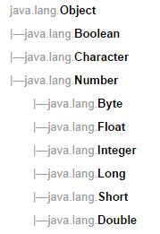

## 1.15 封装类型

### __代码清单__
包：`com.sco._1st` 
类清单： 

* `com.sco._1st.WrapperApiTester`
* `com.sco._1st.WrapperJDK14Tester`
* `com.sco._1st.WrapperJDK15Tester`

### __基本概念__

#### __1.封装类型介绍__
在1.8中讨论的问题没有涉及到下边两点，在讨论下边主题之前先看看Java中的封装类型

* char如何进行转型？
* float和double如何进行转型？精度问题？

什么叫做封装类型？重新看看1.7章节中的类型表格：

<table style="border-collapse:collapse;font-size:12px;">
	<tr style="font-style:italic">
		<td style="width:50px;">简单类型</td>
		<td style="width:120px;">封装类型（复杂类型）</td>
		<td>含义</td>
	</tr>
	<tr>
		<td>byte</td>
		<td>java.lang.Byte</td>
		<td>整型中的字节类型</td>
	</tr>
	<tr>
		<td>short</td>
		<td>java.lang.Short</td>
		<td>整型中的短整型</td>
	</tr>
	<tr>
		<td>int</td>
		<td>java.lang.Integer</td>
		<td>整型中的默认整型数据</td>
	</tr>
	<tr>
		<td>long</td>
		<td>java.lang.Long</td>
		<td>整型中的长整型数据</td>
	</tr>
	<tr>
		<td>char</td>
		<td>java.lang.Character</td>
		<td>Unicode字符集，表示字符</td>
	</tr>
	<tr>
		<td>float</td>
		<td>java.lang.Float</td>
		<td>单精度浮点数</td>
	</tr>
	<tr>
		<td>double</td>
		<td>java.lang.Double</td>
		<td>双精度浮点数</td>
	</tr>
	<tr>
		<td>boolean</td>
		<td>java.lang.Boolean</td>
		<td>逻辑真假布尔值</td>
	</tr>
</table>

这个章节需要讨论的就是Java中的`java.lang`包中的封装类型，针对Java的基础类型而言，每一种基础类型都有与之对应的封装类型，所有封装类型的继承树如下： 

* 封装类型的定义实际上就是Java中典型的class定义，如下图中的java.lang.Float 

* Java的基本数据类型在Memory中存储的时候只会使用到Java的“内存栈”，而封装类型因为属于class/object级别，所以和java.lang.String的存储保持一致，它的存储会同时使用到Java的“内存堆”和“内存栈”
* 封装类型的使用规则和普通Java的Class的使用规则是一致的
* 封装类型和基础类型之间可以进行数据转换：JDK 1.5之前，因为没有“自动拆箱/装箱”（Auto Unbox/Box）的过程，所以转型必须通过手工代码来完成，而从JDK 1.5过后，Java语言可实现一定程度的基础类型和封装类型之间的字段转换过程
* 从继承树上可以看到：Boolean、Character、Number三种类型属于两两不兼容的类型，不兼容的类型是不可以进行自动转换的，这一点等后边讲完了字符型和浮点型的内容过后汇总讨论。

\*：Java语言中的封装类型仅仅针对基本类型而定义，所以在Java语言中只有8种封装类型，详细内容参考上边的表格。

#### __2.JDK 1.4中的转换__

##### __2.1.直接转型问题__
看看下边这段代码：

	Integer a = new Integer(12);
	int b = a;
		
	int c = 12;
	Integer d = c;
这段代码对很多人而言都不陌生，但这段代码在JDK 1.5以下的JDK中无法通过编译，如果是JDK 1.4以及以下的版本需要使用下边的代码进行替换：

	Integer a = new Integer(12);
	int b = a.intValue();
		
	int c = 12;
	Integer d = Integer.valueOf(c);
当所有的封装类型需要转换成基础类型的时候，需要调用对应的`<type>Value`方法： 

* `<var>.intValue();`
* `<var>.shortValue();`
* `<var>.byteValue();`
* `<var>.longValue();`
* `<var>.charValue();`
* `<var>.booleanValue();`
* `<var>.floatValue();`
* `<var>.doubleValue();`

##### __2.2.函数参数问题__
`<var>`表示对应的封装类型定义的变量，如同上边代码的`a`一样，将封装类型转换成基本类型的过程叫做：“拆箱（Unbox）”，而讲基本类型转换成封装类型的过程叫做：“装箱（Box）”，不仅仅如此，在JDK 1.4以及以下的JDK版本中，下边的方法是不能进行参数混淆传递的。

	public void methodA( Integer i ){} // 不可以传入int类型的参数；
	public void methodB( int i ){}     // 不可以传入Integer类型的参数；
##### __2.3.操作符问题__
不仅仅如此，在JDK 1.4中封装类型是不支持：`+, -, *, /`这些符号的，例如下边的代码：

	Integer e = new Integer(13);
	Integer f = new Integer(12);
	Integer g = e + f;				// Incorrect in JDK 1.4
如果要在JDK 1.4中实现这种转换，必须用下边的代码进行替换：
	
	Integer g = Integer.valueOf(e.intValue() + f.intValue());
\*：从上边的例子可以知道在JDK 1.4之前使用封装类型是极不方便的一件事，特别是在进行一定的运算的时候，所以在JDK 1.5的版本中这一块进行了极大的改进，使得封装类型和基本类型可以很方便地进行相互转换。

#### __3.JDK 1.5中的自动拆箱/装箱__

#### __3.1.直接转型__
看看JDK 1.5过后的改变，首先是直接转型的改变：

	Integer a = new Integer(12);
	Integer b = a;
		
	int c = 12;
	Integer d = c;
这段代码和上边的代码是相同的，但在JDK 1.5过后，这段代码就可以直接通过编译了，封装类型和基本类型之间可以互相转换。

##### __3.2.函数参数问题__
再看看下边的代码：

	public void methodA( Integer i ){} 
	public void methodB( int i ){}     
上边两个方法在JDK 1.5过后就没有限制了，传入Integer和int类型的都可以调用成功。

##### __2.3.操作符问题__
最后这段代码：

	Integer e = new Integer(13);
	Integer f = new Integer(12);
	Integer g = e + f;				
上边这段使用操作符的代码在JDK 1.5过后也可以直接使用了。

\*：综上所述JDK 1.5过后把三个不太方便的限制去掉了，使得封装类型更加好用，实际上是JVM自己完成了装箱/拆箱（Box/Unbox）的操作，所以这个功能又称为自动拆箱/装箱（Auto Box/Unbox）。目前关于封装类型没有讨论的话题包括下边几个，这些问题留到OO学习中去讨论：

* 自动装箱拆箱作为参数重载，以及函数返回值问题
* Memory结构
* 类型的自动转换以及Performance的问题
* 封装类型和基本类型适用的场景和不适用的场景
* 反射中的封装类型和基本类型

#### __4.常用封装类API__

##### __4.1.将String转换成基础类型__

	String item = "222";
	int intValue = Integer.parseInt(item);
	short shortValue = Short.parseShort(item);
	Integer intValue1 = Integer.parseInt(item);
这种转型的参数是一个`java.lang.String`，是使用的静态方式的调用，最需要注意的是`parse*`系列的方法的返回值是基础类型，虽然上边第四行代码没有问题，但是主要原因不是因为返回值匹配，而是因为在函数返回的过程中出现了自动装箱。

##### __4.2.valueOf方法__

	int int1 = 212;
	System.out.println(Integer.valueOf(int1));
	System.out.println(Integer.valueOf("234"));
虽然`valueOf`方法在JDK 1.5过后不太常用，但对于一些特殊的函数参数传入的时候，如果对类型要求严格，那么就必须要记得它的返回值类型，有时候会因为自动装箱/拆箱引起的混乱导致在开发过程中忘记了返回值类型引起不必要的错误。

##### __4.3.进制转换方法__
进制转换方法在Number章节已经提到过了，这里再重新看看这几个方法：

__*二进制互转*__

	// 十进制转二进制的字符串
	int integer = 117;
    String binary = Integer.toBinaryString(integer);
	// 二进制字符串转换成十进制数字
	String inputBinary = "100010011";
	int bResult = Integer.parseInt(inputBinary,2);

__*八进制互转*__

	// 十进制转八进制的字符串
	int integer2 = 1024;
    String octal = Integer.toOctalString(integer2);
	// 八进制字符串转成十进制数字
	String inputOctal = "712364";
	int oResult = Integer.parseInt(inputOctal, 8);

__*十六进制互转*__

	// 十进制转十六进制的字符串
	int integer3 = 4096;
    String hex = Integer.toHexString(integer3);
	// 十六进制转成十进制数字
	String inputHex = "FEDD34";
	int hResult = Integer.parseInt(inputHex, 16);

##### __4.4.比较方法__

	int int2 = 21;
	int int3 = 21;
	int int4 = 22;
	System.out.println(Integer.compare(int2,int3));	// 0
	System.out.println(Integer.compare(int2,int4)); // -1
	System.out.println(Integer.compare(int4,int2)); // 1
针对封装类的compare方法可用于比较两个数的大小：

* 左参 = 右参：compare方法返回0；
* 左参 < 右参：compare方法返回-1；
* 左参 > 右参：compare方法返回1； 

### __实验__

目的：理解封装类型 
环境：Eclipse环境

* 实验1：书写一段代码，理解各种封装类型在JDK 1.4和JDK 1.5中的区别；
* 实验2：书写一段代码，理解封装类型中常用的API；