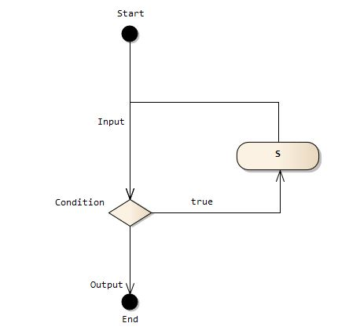
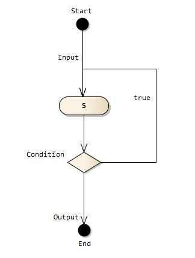

## 1.17 Java中的循环：For, Do-While, While

### __代码清单__
包：`com.sco._1st` 
类清单： 

* `com.sco._1st.WhileCase1`
* `com.sco._1st.DoWhileCase1`
* `com.sco._1st.ForeachTester`
* `com.sco._1st.ForTester`
* `com.sco._1st.ForTester1`
* `com.sco._1st.ForTester2`
* `com.sco._1st.NestedFor`

### __基本概念__
Java里面支持的循环语句主要包含了下边三种：

* while语句
* do-while语句
* for语句（包括JDK 1.5引入的Foreach模式）

#### __1.循环分类__
循环语句表示程序反复执行某个动作或某些操作，直到条件为假（或真）时才停止循环，在循环结果中最核心的一点是：在什么情况下执行循环？那些操作需要重复执行？循环流程的结构基本形式有两种：

* 当型循环 
先判断条件，如果条件为真就执行循环体的内容，并且在循环体结束时自动返回到循环入口处，再次判断循环条件；如果条件为假，则退出循环体达到流程出口处。 

* 直到型循环 
从入口直接进入循环体，循环体结束时判断条件，如果条件为真，则返回入口处继续执行循环体，直到条件为假的时候退出循环体到达出口处，是先执行后判断，这种情况下至少会执行一次循环体的内容。 

循环语句可以实现反复地执行一段代码，它主要包含下边4个部分：

1. 初始化语句（init_statement）：一条或多条语句，这些语句通常完成初始化工作，初始化语句在循环开始之前执行；
2. 循环条件（test_expression）：这是一个boolean表达式，这个表达式决定是否要执行循环体部分的代码，为true的时候执行；
3. 循环体（body_statement）：这个部分是循环体的内容，如果条件允许，这个代码块将重复执行，如果这个部分只有一行语句，可以省略`{}`代码块，但不推荐；
4. 迭代语句（iteration_statement）：这个部分在一次循环体执行结束后，对循环条件求值之前执行，通常用于控制“循环变量”，使得循环在合适的时候结束；

#### __2.while语句__
Java语言中的`while`语句是典型的当型循环，它的主要语法如下：

	[init_statement]
	while(test_expression)
	{
		statement;
		[interation_statement)
	}
这种语句的执行流程如下：

1. 先执行`init_statement`的初始化语句的内容，一般会初始化循环变量；
2. 然后在每次执行循环体之前，执行`test_statement`求值，如果值为true则进入循环体执行，如果为false则直接跳出循环；
3. 循环体执行的结尾一般放`interation_statement`语句，因为本次循环执行结束过后再执行这个语句修改循环变量。

看看while循环的例子：

		// 循环的初始化条件
		int count = 0;
		// 当count小于10的时候执行循环体
		while(count < 10){
			System.out.println(count);
			// 迭代语句
			count++;
		}
		System.out.println("循环结束！");

上边演示了while循环的主体部分内容，最终输出结果如下：

	0
	1
	2
	3
	4
	5
	6
	7
	8
	9
	循环结束！
如果while循环的循环部分和迭代语句合并到一起，且只有一行代码的时候，则可省略while循环后边的`{}`，但这种做法可能降低程序的可读性，不提倡使用——如果省略了花括号，则循环条件仅控制到紧跟在循环条件的第一个分号处。

\*：在使用while循环的时候，一定要保证循环条件有变成false的时候，否则会造成一个死循环，永远无法结束这个循环。

		int count = 0;
		while(count < 10)
		{
			System.out.println("死循环：" + count);
			count--;
		}
		System.out.println("永远不会被执行！");
上边的代码count的值会越来越小，而`count < 10`的条件一直为true，从而导致死循环；不仅仅如此`while`循环有一种常见的陷阱，就是在关键字while后边多了一个分号“;”，很多初学者容易忽略这个陷阱：

		// 循环的初始化条件
		int count = 0;
		// 当count小于10的时候执行循环体
		while(count < 10);
		// 下边的代码和while循环已经没有任何关系了，仅仅是一个块语句
		{
			System.out.println(count);
			// 迭代语句
			count++;
		}
		System.out.println("循环结束！");
乍一看上边代码没有任何问题，但因为while循环后边仅跟了一个分号，所以循环体为空，在没有迭代语句的情况下，这个循环也变成了一个死循环，这一点需要注意。

#### __3.do-while语句__
Java语言中的`do-while`语句就是直到型循环，它和`while`的区别很明显：`while`循环是先判断循环条件，如果条件为true则执行循环体；而`do-while`循环则先执行循环体，然后再判断循环条件，如果为true则执行下一次循环，否则直接中止。`do-while`语句的语法如下：

	[init_statement]
	do
	{
		statement;
		[iteration_statement]
	}while(test_statement);
语句的执行流程如下：

1. 执行`init_statement`语句执行初始化操作；
2. 进入循环执行`statement`的循环体语句；
3. 修改循环变量执行`iteration_statement`的迭代语句；
4. 执行到while检查条件`test_statement`，如果为false跳出循环，如果为true继续执行下一次循环；

对比上边`while`的陷阱，`do-while`的结尾处必须有一个分号，否则这个语句不完整，这个分号表示循环结束。下边的代码演示了`do-while`语句的用法：

		// 定义循环变量
		int count = 0;
		// 执行do while循环
		do{
			System.out.println(count);
			// 循环迭代语句
			count++;
		}while(count < 10);
		System.out.println("循环结束！");

上边的语句输出信息为：

	0
	1
	2
	3
	4
	5
	6
	7
	8
	9
	循环结束！
通过上边的例子注意`while`和`do-while`语句的本质区别，即使输出结果是一样的，但`do-while`在进入循环的时候即使条件为假也会执行一次，如果改成下边的代码就更容易区分了：

		// 定义循环变量
		int count = 0;
		// 执行do while循环
		do{
			// 循环迭代语句
			count++;
			
			System.out.println("\t" + count);
		}while(count < 10);
		System.out.println("\t循环结束！");
输出结果为：

	1
	2
	3
	4
	5
	6
	7
	8
	9
	10
	循环结束！

#### __4.for语句__

##### __4.1.for模式（Standard）__
Java中的for语句属于更加简洁的循环语句，大部分情况下for语句都可以使用while循环、do-while循环代替，所以上边的循环分类里，for语句属于两种类型都可以满足的语句。不仅仅如此，Java从JDK 1.5过后的for语句可支持Foreach模式的迭代，这里先看看for语句的基本语法：

	for([init_statement];[test_expression];[iteration_statement])
	{
		statement;
	}
语句的执行流程如下：

1. 执行初始化语句：`init_statement`初始化循环变量，这个语句只会在初始化的时候执行一次；
2. 每次进入循环体之前，会执行`test_expression`语句，如果条件为true，则执行循环体，否则直接执行迭代语句；
3. 循环体执行过后（`statement`）会执行迭代语句`iteration_statement`。

\*：对于For循环而言循环条件总比循环要多执行一次，因为最后一次执行循环条件为false的时候才不会继续执行循环体。

看看下边的代码段，理解一下：

		// 初始化条件、循环条件、迭代语句都在一行
		for(int count = 0; count < 10; count++ ){
			System.out.println("\t" + count);
		}
		System.out.println("\t循环结束！");
这段的输出如下：

	0
	1
	2
	3
	4
	5
	6
	7
	8
	9
	循环结束！
for循环和while、do-while循环不一样：因为while、do-while循环的迭代语句紧跟着循环体，因此如果循环体不能完全执行，如使用continue语句来结束本次循环，则循环迭代语句就不会被执行，但for循环的迭代语句并没有与循环体放在一起，不管是否使用continue来结束本次循环，迭代语句一样会顺利执行。

不仅仅如此，for的初始化语句可以是“,"语句，即初始化语句可以是两个而不是一个，分析一下下边这段代码的输出：

		for (int b = 0, s = 0, p = 0; b < 10 && s < 4 && p < 10; p++) {
			System.out.println(b++);
			System.out.println(++s + p);
		}
实际上上边的代码初始化变量有三个，但是只能有一个声明语句，如果要声明多个变量就只有使用“,”语句，并且声明的变量的类型必须一致。

For循环有一个陷阱，就是在循环过程中修改了循环变量的情况，例如下边的代码：

		for( int count = 0; count < 10; count++ ){
			System.out.println(count);
			// 修改循环变量
			count *= 2;
		}
		System.out.println("循环结束！");
看看输出理解一下：

	0
	1
	3
	7
	循环结束！
从上边的结果可以知道，实际上这里只执行了4次循环，为什么会这样呢？——就是因为循环体内修改了循环变量的值，谨记：建议不要在循环内修改循环变量（循环计数器）的值，否则会增加程序出错的可能性，万一程序真的需要访问、修改循环变量的值，建议重新定义一个临时变量，将循环变量的值赋给临时变量，然后对临时变量进行修改。 
最后针对for语句需要注意的就是`init_statement`、`test_expression`、`iteration_statement`三个语句之间使用的是分号“;”；

看看下边的代码理解一下常用的For的实战型做法：

		int i = 0;
		for(; i < 10; ){
			System.out.println("\t" + i);
			// 修改循环变量
			i++;
		}
		System.out.println("\t循环结束！");
		// 还可以使用i
上边的代码有一个很大的好处：扩大了初始化语句中定义的变量的作用域，在for循环内定义的变量，作用域只是在for的循环体中生效，for循环一旦终止，这些变量将无法访问，而使用上边的代码就可以使得循环结束后依然可以使用`i`的值，这种情况根据实际情况决定。

##### __4.2.foreach模式（Since JDK 1.5）__
Java语言在JDK 1.5中引入了For循环的Foreach模式，这种模式的循环主要用于不使用循环变量`i`的情况，看看下边的代码：

		final String[] str = {"Hello","Lang","World","Yu"};
		for(final String item: str){
			System.out.println(item);
		}
Java中的Foreach模式使用的关键字还是for，只是语法不同，其语法如下：

	for( [item] : [target] )
	{
		Statement;
	}
* `[item]`表示直接取到的迭代元素，和使用循环变量`str[i]`取得的值是一致的；
* `[target]`表示被迭代的对象信息，这个对象信息和for模式中的对象是一致的；
* Foreach模式中不包含循环变量，而且只能在JDK 1.5以及以上的版本中使用；

\*：一般Foreach模式用于遍历集合特别有作用，特别是针对Set, List, Map这种Java提供的集合数据结构进行迭代遍历是很好用的一种方式。选择使用For模式和Foreach的模式的关键在于循环变量是否使用，如果不使用那么大部分情况下Foreach模式比For模式简单许多。

		final List<Integer> list = new ArrayList<>();
		list.add(12);
		list.add(100);
		list.add(300);
		for(final Integer item: list){
			System.out.println("\t" + item);
		}
最后说一点：`item`的数据类型和`target`中元素的数据类型必须保持一致，及`target`必须是可支持迭代的`item`对应数据类型的集合，如果类型不匹配会导致无法通过编译。

#### __5.嵌套循环__
如果把一个循环放到另外一个循环内，那么就可以形成嵌套循环，嵌套循环可以是上边提供的三种循环四种模式的两两任意组合。当程序遇到嵌套循环时，如果外层循环的循环条件允许的话则执行外层循环，而内层循环会当做外层循环的循环体执行，这里仅仅提供一段代码演示：

		for( int i = 0; i < 3; i++ ){
			for( int j = 0; j < 4; j++ ){
				System.out.println("\ti的值为：" + i + ",j的值为：" + j);
			}
		}
上边的代码使用的两个for语句的嵌套，输出如下：

	i的值为：0,j的值为：0
	i的值为：0,j的值为：1
	i的值为：0,j的值为：2
	i的值为：0,j的值为：3
	i的值为：1,j的值为：0
	i的值为：1,j的值为：1
	i的值为：1,j的值为：2
	i的值为：1,j的值为：3
	i的值为：2,j的值为：0
	i的值为：2,j的值为：1
	i的值为：2,j的值为：2
	i的值为：2,j的值为：3
*：对于i和j的两层循环要清楚哪一层循环先执行，这个是嵌套循环的基本功。

### __实验__

目的：理解While, Do-While, For 
环境：Eclipse环境

* 实验1：书写一段代码，理解While语句；
* 实验2：书写一段代码，理解Do-While语句；
* 实验3：书写一段代码，理解For语句的标准模式；
* 实验4：书写一段代码，理解For语句的Foreach模式；
* 实验5：定义一个8 x 8的二维boolean数组，如果 i + j 是4的倍数怎设置为false，否则设置成true，最后打印这个二维数组；
* 实验6：定义一个8 x 8的二维int数组，所有值设置成0，将对角线的值设置成1，并打印；
* 实验7：定义一个10 x 10的二维int数组，所有值设置成0，将上三角和下三角分别设置成1，并打印；

