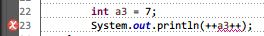
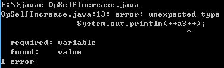
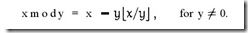

## 1.21 一元操作符

### __代码清单__
包：`com.sco._1st` 
类清单： 

* `com.sco._1st.OpBigNegation`
* `com.sco._1st.OpComplexBit`
* `com.sco._1st.OpIDForm`
* `com.sco._1st.OpLeftRight`
* `com.sco._1st.OpNegation`
* `com.sco._1st.OpSelfIncrease`
* `com.sco._1st.OpTypeConvertion`

### __基本概念__
前一个章节介绍了Java中的分隔符，本章主要介绍Java语言是优先级排名仅次于分隔符的一元操作符：

<table style="border-collapse:collapse;font-size:12px;">
	<tr style="font-style:italic">
		<td style="width:140px;">运算符类型</td>
		<td style="width:50px;">结合顺序</td>
		<td style="width:100px;">运算符</td>
		<td>总数</td>
	</tr>
	<tr>
		<td>一元运算符 Unary Operators</td>
		<td>右结合</td>
		<td>++&nbsp;&nbsp;&nbsp;&nbsp;--&nbsp;&nbsp;&nbsp;&nbsp;~&nbsp;&nbsp;&nbsp;&nbsp;!</td>
		<td>4</td>
	</tr>
</table>

* 一元操作符： 计算机语言中一般把一个运算表达式语句分为“操作数”和“操作符”两部分，如果只需要一个操作数和一个操作符就可以构成拥有语义的表达式语法则称这种操作符为一元操作符，Java中的一元操作符主要有4个，本章节对这四个一元操作符进行详细介绍。

__关于左结合和右结合__ 
在讲解操作符之前先看看计算机中的左右结合的概念：一个多运算对象的表达式运算时的先后顺序是先看优先级，高优先级的先计算，低优先级的后计算！如果优先级相同的情况下，就要看结合性，如果是左结合的运算符从左向右运算，相反如果是右结合的运算符则从右往左计算。看看左右结合的例子：

	int i = 0;
	System.out.println(12-~++i+~i);
上边的表达式可以拆成`12 - (~(++i)) + (~i)`，先计算`++i`，计算后`i`的值变成1，而`~(++i)`结果为`-2`，随后计算`~i`的值，这个时候因为`i`的值为1，所以`~i`的值为-2，所以最后结果成了：`12 - (-2) + (-2)`，最终输出结果为：`12`。 
仔细看看表达式`(~(++i))`，因为`~`和`++`两个操作符都是右结合性，所以从右往左运算，最先计算的是`++`，其次才是`~`。

#### __1.自增运算`++`__
自增运算符又称为自加运算符，它属于单目运算符，即本文提到的“一元操作符”。自增运算符会将操作数直接“加一”（算术运算）得到一个新值而改变此操作数，自增运算符有两个注意点：

* 它属于一元运算符，只能操作一个操作数；
* 自增运算符只能操作单个数值型（整型、浮点型都可）的变量，不可操作于常量或表达式。

自增运算符可以出现在操作数的左边，也可以出现在操作数的右边，有一点小小的区别就是出现在左边和右边的效果是不一样的。

* 左边：如果`++`出现在操作数的左边，则先把操作数“加一”，然后才把操作数放入表达式中进行运算；
* 右边：则先把操作数放到表达式中进行运算，然后再把操作数“加一”；

通过下边的代码来分别`++`放到左边和右边不同的效果：

		int a1 = 5;
		int b1 = a1++ + 6; // 运算符在操作数右边
		System.out.println("\tb1的值为：" + b1);
		System.out.println("\ta1的值为：" + a1);
		int a2 = 5;
		int b2 = ++a2 + 6; // 运算符在操作数左边
		System.out.println("\tb2的值为：" + b2);
		System.out.println("\ta2的值为：" + a2);
先看看这段代码的输出，然后再来分析上边提到的“左边”和“右边”的区别：

	b1的值为：11
	a1的值为：6
	b2的值为：12
	a2的值为：6
从上边的输出结果可以得到下边的结论：

1. `++`的自增运算符的优先级高于`+`运算符，在表达式中优先计算；
2. `++`不论放到左边还是右边，在表达式运算完成过后都会修改操作数的值，上边运算结束后`a1`和`a2`的值最后都变成了`6`；
3. `++`放在右边的时候，表达式先运算，然后再计算操作数的值，所以`b1 = 5 + 6`结果为`11`;
4. `++`放在左边的时候，先将操作数进行“自增”，然后再将“自增”结果放到表达式中运算，所以最后`b2 = 6 + 6`结果为`12`；

#### __2.自减运算`--`__
自减运算符和自加运算符基本用法是一致的，唯一不同的是自减会将操作数“减一”（算术运算）然后得到一个新值而改变操作数，这里就不详细介绍`--`操作符了。

\*：自增和自减运算只能用于操作数，不可以用于字面量、常量、表达式等运算，如下边的写法属于错误写法：

	5++;	// Incorrect
	--6;	// Incorrect
然后看看下边的表达式，仔细分析一下其错误原因： 
 
看看使用IDE报错的位置，从上边的图可以知道：当自增/自减运算符同时放到操作符左右两边的时候，因为`++`和`--`属于“右结合”的操作符，所以编译器会先默认`++a3`是已经通过编译的部分，根据上边的规则：自增和自减操作符不能用于表达式，所以编译器最终将`++a3++`解析成了`(++a3)++`，当`++`紧随表达式`++a3`的时候，编译器就会报错，而且报错的位置是右边的`++`运算符，而不是左边的`++`符号，即使是使用`javac`的命令也会得到下边的结果： 
 

\*：简单说明一下，实际上完全把`++`和`--`归纳成右结合应该属于有误的，实际上只有当`++`和`--`放到操作数的左边的时候，会被编译器识别成为“右结合”运算符，而在这个时候，其优先级大于算术运算。从上边的两段代码可以做这样一个优先级排名推测：右结合自增/自减运算 > 算术运算 > 左结合自增/自减运算，所以这也是导致编译器优先解析了“右结合自增/自减运算符"的直接原因，实际上从上边例子的结果就可以知道编译器会优先处理优先级最高的运算表达式，然后再处理优先级低的运算表达式。 

#### __3.非运算`!`__
Java里面的非运算也是右结合一元运算符，只是这个操作符有一个限制：它运算的操作数的类型必须是boolean类型的数据。

* 如果操作数的值是true，则经过它的运算过后结果为false；
* 如果操作数的值是false，则经过它的运算过后结果为true;

除此之外，其他类型的数据是不能进行非运算的，看看下边的代码段，理解一下这个运算符。

		int i = 22;
		boolean x = true;
		// System.out.println(!22); Incorrect
		System.out.println(!x);
		System.out.println(!(i > 10));
从上边的代码可以知道`!`运算符是一个比较特殊的运算符，它所运算的操作数必须是一个boolean类型的操作数，或者返回boolean类型的表达式，其他类型不可用于`!`运算。

#### __4.取反运算`~`__
最后一个需要介绍的运算符是`~`，这个运算符是一个按位取反的一元操作符，它将操作数的每个位（包括符号位）全部取反，先看看这个运算符相关的代码，然后来分析其流程和步骤。

		int number1 = 245;
		int number2 = -100;
		System.out.println(~number1);
		System.out.println(~number2);
		System.out.println(~~~number1);
上边的代码会输出：

	-246
	99
	-246

【补充】

1）__机器数 VS 真值__ 
这里先补充一下计算机的原码、反码、补码的基础知识，一个数在计算机中的二级制表示，叫做这个数的机器数，机器数是带符号的，在计算机用一个数的最高位存放符号（符号位），正数使用0，负数使用1。
如：`2`计算机的字长为8位，转换成二进制是`0000 0010`，如果是`-2`则就是`1000 0010`，那么这里的`0000 0010`和`1000 0010`就是机器数。

因为第一位是符号位，所以机器数的形式值就不等于真正的数值，如上边的有符号的`1000 0010`，最高位1代表负，而真正数值是`-2`而不是`130`（`1000 0010`转换成十进制等于130），所以，为了区别起见，将带符号的机器数对应的真正数值称为机器数的真值。

`0000 0001`真值为`+000 0001 = +1`，`1000 0001`的真值为`-000 0001 = -1`；

2）__原码、反码、补码__ 
很多人不能理解，计算机为什么要使用补码，先了解一下原码、反码、补码的概念，对于一个数，计算机要使用一定的编码方式进行存储，原码、反码、补码是机器存储的一个具体数字的编码方式。

*原码* 
原码就是符号位加上真值的绝对值，即用第一位表示符号位，其余位表示值，比如8位二进制：

	[+1]原 = 0000 0001
	[-1]原 = 1000 0001
第一位是符号位，0表示正数，1表示负数，因为第一位是符号位，所以8位二进制的取值范围为：`[1111 1111, 0111 1111]`（即 [-127,127] ），原码是最容易理解的一种方式。

*反码* 
反码的表示方法是：

* 正数的反码是其本身
* 负数的砝码是在其原码的基础上，符号位不变，其余各位取反

看看下边的例子：

	[+1]原 = 0000 0001 = [0000 0001]反
	[-1]原 = 1000 0001 = [1111 1110]反
可见，如果一个反码表示的是负数的话，人脑是无法直接看出来它的数值是多少，必须转换成原码再计算才行。

*补码* 
补码的表示方法是：

* 正数的补码就是其本身
* 负数的补码是在其原码的基础上，符号位不变，其余各位取反，最后`+1`（即反码的基础上 +1 ）。

看看下边的例子：

	[+1]原 = 0000 0001 = [0000 0001]反 = [0000 0001]补
	[-1]原 = 1000 0001 = [1111 1110]反 = [1111 1111]补
对于负数，补码的表示方式也是人脑无法直接看出其数值的，通常也需要转换成原码再计算器数值。

3）__为什么？__ 
从上边的知识点可以知道，计算机有三种编码表示方式，对于正数：

	[+1]原 = 0000 0001 = [0000 0001]反 = [0000 0001]补
而对于负数：

	[-1]原 = 1000 0001 = [1111 1110]反 = [1111 1111]补
所以原码、反码和补码是截然不同的，既然原码才是被人脑直接识别用于计算表示方式，为何还会有反码和补码呢？ 
首先，因为人脑可以知道第一位是符号位，在计算的时候会根据符号位，选择对真值（参考1））区域的加减，但是对于计算机，加减乘除已经是最基础的运算，要设计的尽量简单。计算机识别“符号位”显然会让计算机的基础电路设计变得十分复杂！于是人们想出了讲符号位也参与运算的方法，根据四则运算：减去一个整数等于加上它的负数，即：`1-1 = 1 + ( -1 ) = 0`，所以对计算机而言，只有加法而没有减法，这样计算机运算的设计就更简单了。

__探索1__：将符号位参与运算，并且保留加法的方法——原码篇 
如果使用原码计算十进制的`1 - 1 = 0`

	1 - 1 = 1 + ( -1 ) = [0000 0001]原 + [1000 0001]原 = [1000 0010]原 = -2
显然，如果使用原码表示减法的话，若让符号位也参与运算，结果是不正确的，这就是为什么计算机不使用原码表示一个数的原因。

__探索2__：反码篇 
如果用反码进行运算，则十进制：`1 - 1 = 0`

	1 - 1 = 1 + ( -1 ) = [0000 0001]原 + [1000 0001]原 = [0000 0001]反 + [1111 1110]反 = [1111 1111]反 = [1000 0000]原 = -0
如果用反码运算减法，结果的真值部分是正确的，而唯一的问题出现在“0”这个特殊的数值上，虽然人们的理解上`+0`和`-0`是一样的，但是`0`带符号没有任何意义，而会有`[0000 0000]原`和`[1000 0000]原`两个编码表示0。

__探索3__：补码篇 
如果用补码运算减法，则十进制：`1 - 1 = 0`

	1 - 1 = 1 + ( -1 ) = [0000 0001]原 + [1000 0001]原 = [0000 0001]补 + [1111 1111]补 = [0000 0000]补 = [0000 0000]原 = 0
这样0就使用[0000 0000]表示，而以前出现的-0就不存在了，而且可以用[1000 0000]表示-128：

	(-1) + (-127) = [1000 0001]原 + [1111 1111]原 = [1111 1111]补 + [1000 0001]补 = [1000 0000]补
所以在补码运算中`[1000 0000]补`就是-128，但需要注意因为实际上是使用的-0补码来表示-128，所以-128并没有原码和反码表示，如果使用原码计算`[1000 0000]补`计算出来的原码是`[0000 0000]原`，这个是不正确的。

\*：使用补码，不仅仅修复了0的符号以及存在两个编码的问题，而且还能够表示一个最低数，这就是为什么8位二进制，使用原码或反码表示的范围是[-127,+127]，而使用补码表示的范围为[-128,127]

因为机器使用补码，所以对于编程中常见的32位int类型，可以表示的范围是：[-231, 231 - 1]，因为第一位表示的是符号位，而使用补码表示时又可多保存一个最小值。

4）__深入再探__ 
计算机巧妙地将符号位参与了运算，并且将减法编变成了家法，背后蕴含了什么样的数学原理呢？想象一下钟表，如果把钟表当成1位的12进制数，当前时间是6点，希望将时间设置成4点，怎么做呢？

1. 往回拨2个小时：`6 - 2 = 4`;
2. 往前拨10个小时：`( 6 + 10 ) mod 12 = 4`;
3. 往前拨10 + 12 = 22个小时：`( 6 + 22 ) mod 12 = 4`；

其中mod是取模操作，16 mod 12 = 4即用16除以12后余数是4，所以钟表往回拨（减法）的结果可以用往前拨（加法）代替！现在焦点就落在了如何用一个正数来代替负数，上边可以知道“修正”的做法，但是需要使用数学理论来“修正”而不是猜测。

__同余__ 
两个整数a, b，如果它们除以整数m所得的余数相加，则称a, b对于模m同余，记做：`a = b ( mod m )`，读作a与b关于模m同余。例：

	3 mod 12 = 3
	15 mod 12 = 3
	27 mod 12 = 3
则3，15，27关于模12同余。

__负数取模__ 
正数进行mod运算很简单，但负数呢？下边是关于mod运算的数学定义：

 
上面的公式意思是：
x mod y等于x减去y乘上x与y的商的下界，举个例子（这里`[]`表示取下界）： 

	-3 mod 2
	= -3 - 2 x [ -3/2 ]
	= -3 - 2 x [ -1.5 ]
	= -3 - 2 x ( -2 )	// -1.5的下界就是-2，如果是-0.8的下界就是-1
	= -3 - ( -4 )
	= -3 + 4
	= 1

__开始证明__ 
有了上边的两个理论基础，来证明，回到时钟问题：

	回拨2小时 = 往前拨10小时
	回拨4小时 = 往前拨8小时
	回拨5小时 = 往前拨7小时
得到下边的等式：
	
	// 第一对
	( -2 ) mod 12 = 10
	10 mod 12 = 10
	// 第二对
	( -4 ) mod 12 = 8
	8 mod 12 = 8
	// 第三对
	( -5 ) mod 12 = 7
	7 mod 12 = 7
也就是说，如果实现使用正数代替负数，只需要运用同余的两个定理：

* 反身性： `a ≡ ( a mod m )`;
* 线性运算定理： 如果`a ≡ b ( mod m ), c ≡ d ( mod m)`，那么： 
(1) `a ± c ≡ b ± d ( mod m )`; 
(2) `a * c ≡ b * d ( mod m )`; 

定理证明链接：[线性运算定理](http://baike.baidu.com/view/79282.htm)

根据上边的原理可以知道：

	7 ≡ 7 ( mod 12 )
	( -2 ) ≡ 10 ( mod 12 )
	7 -2 ≡ 7 + 10 ( mod 12 )
现在为一个负数，找到了它的正数的同余数，但并不是`7 -2 = 7 + 10`，而是`7 -2 ≡ 7 + 10 ( mod 12 )`，即计算结果的余数相等。

__回到二进制__ 

*反码篇* 
先看看 `2 - 1 = 1` 的问题：

	2 - 1 = 2 + ( -1 ) = [0000 0010]原 + [1000 0001]原 = [0000 0010]反 + [1111 1110]反
先到这一步，-1的反码表示是`1111 1110`，如果这里将`[1111 1110]`认为是原码，则`[1111 1110]原 = -126`，除去符号位则认为是126，则规律如下：

	(-1) mod 127 = 126
	126 mod 127 = 126
`2 -1`和`2 + 126`的余数结果是相同的，而这个余数，正是期望的计算结果：`2 - 1 ≡ 1`，所以一个数的反码，实际上是这个数相对于一个模的同余数，而这个模并不是二进制，而是所能表示的最大值！（比如8位的`127:[1111 1111]`），这就和钟表一样了，转了一圈过后总能找到在可表示范围内容的一个正确的值。
而`2 + 126`显然表示钟表转过了一圈，因为符号位是参与计算的，正好和移除的最高位形成了正确的计算结果。既然反码可以将减法变成加法，那么使用补码呢？

*补码篇* 
为什么反码 +1还能得到正确的结果呢？

	2 - 1 = 2 + ( -1 ) = [0000 0010]原 + [1000 0001]原 = [0000 0010]补 + [1111 1111]补
如果把`[1111 1111]`当成原码，去掉符号位，则：

	[0111 1111]原 = 127
其实，在反码基础上+1，知识相当于增加了模的值：

	(-1) mod 128 = 127
	127 mod 128 = 127
	2 -1 ≡ 2 + 127 ( mod 128 )
此时相当于128个刻度钟表转了一周，而128正好是8位二进制的一周，所以用补码表示的运算结果的最大值是`[-128,128]`，但是由于0的特殊情况，没有办法表示128，所以补码的取值范围是`[-128, 127]`。

那么到这里过后，原码、反码、补码的知识就补充完整了。

#### __5.复杂运算__
学习了上边的代码，看看复杂的例子来彻底理解一下上边的几种运算符，例子中主要是`++`和`!`，因为学会了`++`过后，`--`就自然会了，而上边已经补充了和原码、反码、补码相关的知识点，所以例子中也不需要再详细讲解`~`运算的用法。

		// 1.++基本用法再探
		int n = 3;
		System.out.println(n == (n++));
		System.out.println(!(n == (++n)));
		// 2.复杂的++表达式
		int i = 4;
		int j = 6;
		int result = i+++ ++j+i+++ ++i+i+ ++i;
		System.out.println("result:" + result);
		// 3.复杂的++表达式
		int a = 5;
		int result1 = a+++a+++a+++a++;
		System.out.println("result1:" + result1);
先看看这段代码的输出内容：

	true
	true
	result:38
	result1:26
1）__基本用法__ 
先分析一下第一部分的内容，在分析第一部分内容时候先注意这句话：`!(n == (++n))`，实际上后边两行的目的是比较`n == (n++)`和`n == (++n)`的不同，但因为这里有一个符号`!`存在，所以一定要注意上边代码的陷阱，都输出为true并不代表这两行代码是一样的，实际上`n == (++n)`的值是false的。 
理解下边内容时先提供两个等价等式（这里等价仅仅表示值修改等价，也就是改变了）： 

	n++; 等价于 n = n + 1;
	n--; 等价于 n = n - 1;
整理一下结果：

* `n == (n++)`：true
* `n == (++n)`：false

实际上这两段代码彻底说明了`++`和`--`的基础用法，再强调一下：

1. 当自增/自减位于操作数右边时，表达式先计算，也就是说`n == (n++)`可以分成两步：`n == n`，`(n++) -> n = n + 1`，所以这种情况下`n == (n++)`的比较结果为true；
2. 当自增/自减位于操作数左边时，自增/自减先计算，也就是说`n == (n++)`可以分成两步：`(++n) -> n == n + 1`，`n == (n + 1)`，所以这种情况下`n == (++n)`的比较结果为false；（因为代码中使用了`!`操作符，所以最终打印的结果依然是true。）

2）__压栈分析__ 
接下来看看i，j那条语句：

		int result = i+++ ++j+i+++ ++i+i+ ++i;
先把上边的表达式进行分析过后执行分解分解成下边的表达式，有了下边表达式过后其执行流程会变得相对清晰很多：

		int result = i++ + ++j + i++ + ++i + i + ++i;
简单分析一下最终输出`38`的原因，模拟一个堆栈结构来分析表达式中的各个部分的内容：

1. 最先入栈的是`i++`，因为`i`的值为4，那么根据上边提到的第一条，`i++`的返回为4，但是运算过后`i`的值变成了5 结果为：`4 + `
2. 其次入栈的是`++j`，因为`j`的值为6，根据上边提到的第二条，`++j`的返回为7，运算过后`j`就变成了7 结果为：`11 +` <= `4 + 7 + `
3. 然后和第一步做同样的操作，这个时候`i`的值为5，那么`i++`返回5，运算过后`i`的值变成6 结果为：`16 +` <= `4 + 7 + 5 + `
4. 随后入栈的是`++i`，`i`的值为6，`++i`的值为7，运算过后`i`的值变成了7 结果为：`23 + ` <= `4 + 7 + 5 + 7 + `
5. 这一步不需要解释，不带任何自增和自减 结果为：`30 + ` <= `4 + 7 + 5 + 7 + 7 + `
6. 最后执行末尾的`++i`，`i`的值为7，`++i`的值为8，运算过后`i`的值也变成了8，不过这个时候除非后边代码还会用到i，否则i的值已经不重要了。 结果为：`38 .` <= `4 + 7 + 5 + 7 + 7 + 8`

所以这行代码最终的输出结果为`38`，注意每一次运算`++x`和`x++`的时候参与运算的值和x本身的变化就很容易分析了。

3）__分析式子__ 
最后看看这种表达式的分析：

		int result1 = a+++a+++a+++a++;
上边的式子进行拆分过后最终形成下边的结构：

		int result1 = a++ + a++ + a++ + a++;
是不是简单多了？先看看下边常见的写法误区： 
合法写法：

		i+++ ++i
		i+++i++
		i+ ++i
		i+++i
		i++ +(++i)
非法写法

		i+++++i
		i++ +++i
所有和自增、自减运算相关的其他写法在代码中会有说明，看看下边的片段：

		result = ++i+i;
		// result = ++i++i; 				Incorrect
		// result = ++i+++i;				Incorrect
		// result = ++i +++i; 				Incorrect
		result = ++i +(++i);
		// result = ++i++++i;				Incorrect
		result = ++i+i++;
		// result = ++i++i++;				Incorrect
		// result = ++i+++i++;				Incorrect
		// result = ++i +(++i)++;			Incorrect
		result = i+i++;
		// result = i++i++;					Incorrect
		result = i+++i++;
		// result = i++++i++;				Incorrect
		// result = i+++++i++;				Incorrect
		// result = i++i;					Incorrect
		result = i+++i;
		result = i++ +(++i);
看完了上边的例子，就能够彻底理解`++`和`--`的相关内容了，包括合法以及不合法的写法，因为Eclipse这种IDE会自己带语法编译器，如果表达式无法通过编译会直接报错，例如上边代码段中的`Incorrect`会被IDE识别出来，但尽可能人工分析一次以加深理解和记忆。

#### __6.强制类型转换__
强制类型转换运算符一般用(type)表示，看看下边的代码理解一下：

		long a = 1;
		int c = (int)a;
		System.out.println(c);
		long b = 65536;
		short d = (short)b;
		System.out.println(d);
前边章节已经说过，如果Java的隐式转换不能执行自动转换的时候，则需要显示转换，实际上强制类型转换等价于显示转换，使用的操作符为`(type)`，上边的代码已经说明了这种操作符的用法，其输出为：

	1
	0
强制类型转换后边很多章节都会遇到，这里只是说明了基础类型中的强制类型转换，至于对象相关的这里没有说明，简单总结一下：

* 强制类型转换不会执行范围检查，比如`short`类型的最大值是65535，当直接将一个65536的`long`类型强制转换成short类型的时候，越界过后直接使用位的真值来换算，所以最终结果输出是`0`，这个也是Java中避免强制转换的主要原因；
* 强制类型转换是Java语言中显示类型转换中最不标准的一种，但有时候在编程过程有必要使用强制类型转换，特别是在非基础类型的转换中；
* 强制类型转换只有在自动转换失效的时候使用，如果本身支持自动类型转换的情况就没有必要使用强制类型转换；

### __实验__

目的：理解各种一元运算符 
环境：Eclipse环境

* 实验1：书写一段代码，理解一元运算符：`++`
* 实验2：书写一段代码，理解一元运算符：`--`
* 实验3：书写一段代码，理解一元运算符：`!`
* 实验4：书写一段代码，理解一元运算符：`~`
* 实验5：书写一段代码，理强制类型转换符：`(type)`

