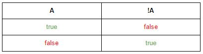
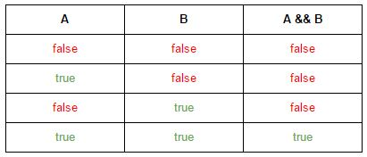
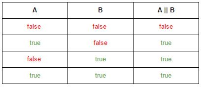
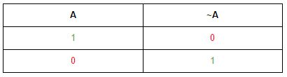
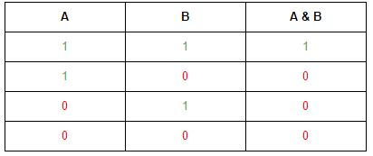
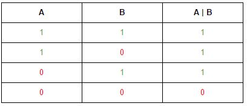
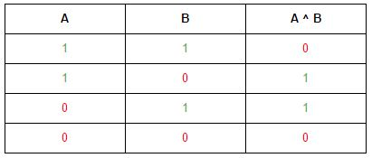

## 1.24 逻辑运算符

### 代码清单
包：`com.sco._1st` 
类清单： 

* `com.sco._1st.LOpBit`
* `com.sco._1st.LOpBoolean`
* `com.sco._1st.LOpDiff`
* `com.sco._1st.LOpNonBit`
* `com.sco._1st.LOpShortShift`

### 基础概念
Java中的逻辑运算符主要用于操作两个布尔类型（boolean）的常量或者变量，逻辑运算符主要有六个，分为下边两类：

* 基本逻辑运算符：可以结合表达式生成一个boolean的结果值，支持“短路操作”：`&&，||，!`；
* 按位运算符：可支持两个boolean的结果值变成逻辑运算符，但也支持其他数据类型的操作，不支持“短路”操作：`&，|，^`，这三种运算分别对应四种逻辑关系：`AND, OR, XOR`，*：`!`是不支持位运算的，也就是说在Java位运算中没有`NOT`这个概念。

在看这些操作符之前先看看基本的逻辑关系表【主要针对bolean值】：

1）基本逻辑运算：

**NOT** 非运算： 

**AND** 与运算： 

**OR** 或运算： 

2）位逻辑运算：

**NOT** 位非运算： 

**AND** 位与运算： 

**OR** 位或运算： 

**XOR** 异或运算： 

_**关于短路**_ 
短路现象对计算机而言是一种在逻辑组合表达式中常见的现象，看看下边的例子：

	if( 1 == 1 && 1 == 2 && 1 == 3 )
在上述的表达式中，`&&`运算符连接了三个boolean表达式，在运算的时候，因为`&&`是左结合的，所以运算顺序是从左往右开始运算，看看运算流程：

1. 第一个表达式为`1 == 1`，值是true，则继续运算；
2. 第二个表达式为`1 == 2`，值是false，因为是与运算，所以第二个表达式计算完成过后结果如下： `true && false && 1 == 3` 这个时候整个表达式的最终结果值已经出来了，这个表达式不可能为true；
3. 因为整个表达式的最终结果值已经出来，所以`1 == 3`这个表达式就不再计算了！【这种现象就称为“短路”现象】；

简单说来，“短路”现象可以这样理解，在一个组合逻辑表达式中，如果通过逻辑运算关系知道了整个组合表达式的最终结果值，那么计算机不再对其他的表达式进行运算，常见的短路现象出现在`&&`和`||`两个操作符中：

* `&&`：计算机会在处理这种表达式的时候遇到第一个false时执行“短路”；
* `||`：计算机会在处理这种表达式的时候遇到第一个true时执行“短路”；

*：位逻辑运算不支持短路现象！

#### 1. 位逻辑运算
因为逻辑运算符中位逻辑的运算符属于优先级比较高的运算符，所以先介绍位逻辑运算符，按照优先级排序：

* &：按位与运算，操作两个boolean值时只要有一个值为false则结果为false，针对位时只要有一个位为0，则最终这个位的结果为0；
* ^：按位异或运算，当两个操作数不同时返回true，如果两个操作数相同则返回false，同理如果两位同时为1或0时则返回false，不同时则返回true；
* |：按位或运算，操作两个boolean时只要有一个值为true则结果为true，针对位时只要有一个位为1，则最终这个位的结果为1；

**1）普通位运算**

位与运算不仅仅可以执行逻辑与的操作，对boolean类型的数据而言完全可以达到逻辑与的效果，因为boolean数据本身的特殊性（占用空间1个byte，但是只使用了1个bit。），而当&用于其他类型的数据运算的时候也是可行的，这小节先看看普通的位运算。

		int a = 1;
		int b = 2;
		System.out.println( a & b );
		
		String a1 = "Hello";
		String a2 = "World";
		// System.out.println(a1 & a2); Compile Error
上边的代码对两种类型执行了位与运算，一种是`int`，另外一种是`String`，但是从位与运算的定义可以知道这种运算是不支持String类型的，可以这样理解位运算并不支持所有的类型，对Java语言而言，位运算只能支持基础类型中除开`float`和`double`的六种类型：

		short a3 = 1;
		short b3 = 2;
		System.out.println(a3 & b3 | b);
		
		long a4 = 1L;
		long b4 = 2L;
		System.out.println(a4 | b4 & a3);
		
		float f1 = 1.1f;
		float f2 = 1.3f;
		// System.out.println(f1 & f2); Commpile Error
		
		char c = 'a';
		char e = 'l';
		System.out.println( c & e);
		
		// System.out.println( 0.3 & 1.2 ); Compile Error
		System.out.println( true & false );
从上边的代码示例可以知道位运算支持的操作数类型。

**2）逻辑位运算**

逻辑位运算主要用于逻辑条件检查以及boolean值的赋值操作，看看下边的代码：

		int inputArg = Integer.parseInt(args[0]);
		boolean result = inputArg > 3 & inputArg < 10;
		System.out.println(result);
		if( 3 < inputArg & inputArg < 100){
			System.out.println("Between 3 and 100. ( Exclued )");
		}else{
			System.out.println("Not in range.");
		}
如果提供了`args[0]`，而且满足条件，则会输出：

	true
	Between 3 and 100. ( Exclued )

所以总结起来如下：

* 位运算可以用于`int`、`long`、`short`、`byte`、`char`、`boolean`基本类型的运算；
* 位运算做逻辑运算时的结果和操作数的结果一致，而且可进行结果赋值；
* 条件运算中的逻辑运算和非位逻辑运算的思路是一致的；

*：关于异或运算可自己写个程序来验证以及理解。

#### 2. 非位逻辑运算

Java中的非位逻辑运算主要包含三种：`&&, ||, !`，实际上`!`只可以作为位boolean的符号，看看这三个符号的解释：

* !：非操作，只要一个操作数为true则返回false，如果操作数为false就返回true；
* &&：与，前后两个操作数必须是true才能返回true，否则返回false；
* ||：或，前后两个操作数必须是false才能返回false，否则返回true；

**1）逻辑运算**

这三个操作符的操作数支持下边几种【这里的boolean类型包括：`java.lang.Boolean`】：

* boolean类型的常量或者变量；
* 返回boolean值的逻辑表达式；
* 返回boolean类型的函数、包括静态函数和成员函数；

看看下边一段代码来理解这三个操作符：

		int inputArg = Integer.parseInt(args[0]);
		if( 5 < inputArg && inputArg < 10){
			System.out.println("Between 5 and 10;");
		}else{
			System.out.println("Not in range.");
		}
		
		if( inputArg < 10 || inputArg > 20 ){
			System.out.println("Not between 10 and 20.");
		}else{
			System.out.println("Out of scope.");
		}
		
		if(!(inputArg < 0)){
			System.out.println("OK to compare.");
		}else{
			System.out.println("Not OK.");
		}

如果输入参数为7则会有下边的输出：

	Between 5 and 10;
	Not between 10 and 20.
	OK to compare.

**2）关于“短路”**

Java中一再强调了“短路”，为了加深“短路”概念的理解，再看一段代码来理解逻辑运算符的短路操作：

		int a = 1;
		int b = 1;
		
		if( a < 0 && (++a) > 1){
			System.out.println("\tNonBit workflow!");
		}else{
			System.out.println("\tNot increased!");
		}
		
		if( b < 0 & (++b) > 1){
			System.out.println("\tBit workflow.");
		}else{
			System.out.println("\tFalse but increased!");
		}
		
		System.out.println("\ta = " + a);
		System.out.println("\tb = " + b);

这段代码不关心前边的输出，主要关注`a`和`b`的最终值，看看输出部分：

	Not increased!
	False but increased!
	a = 1
	b = 2
从上边的逻辑可以看到，b的值被改变了，因为`(++b) > 1`也进入了运算，没有出现“短路”现象。

在条件比较多而且复杂的时候，尽可能使用带短路的操作符，因为计算机会减少很多运算，位逻辑一般只是在运算的时候纳入使用，在`if`条件检查过程中使用逻辑运算符号足够。可以这样理解，位运算虽然支持逻辑运算，但目的是为了处理字节级别的位基本逻辑操作，不用于条件检查，条件检查一般使用的就是非位逻辑的运算符：`&&, ||, !`。

### __实验__

目的：理解逻辑运算符 
环境：Eclipse环境

* 实验1：书写一段代码，理解比较运算符：`&, |, ^`
* 实验2：书写一段代码，理解等价运算符：`&&, ||`
* 实验3：书写一段代码，理解这些操作符的优先级